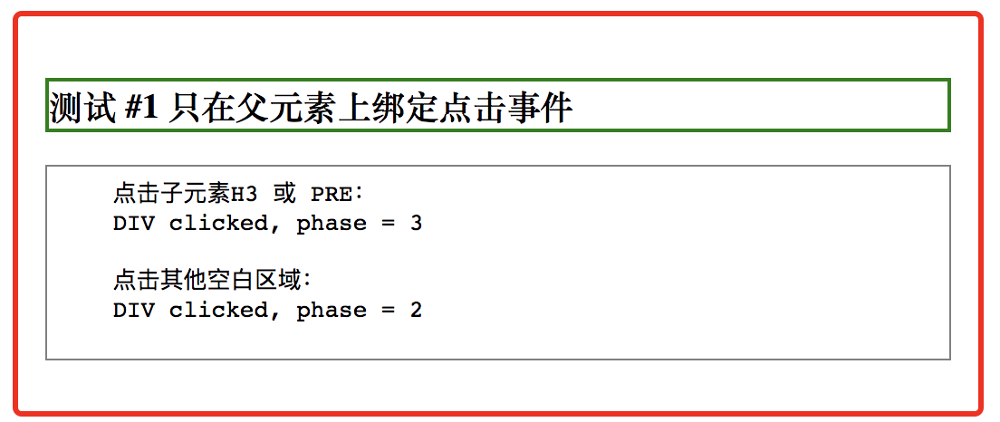
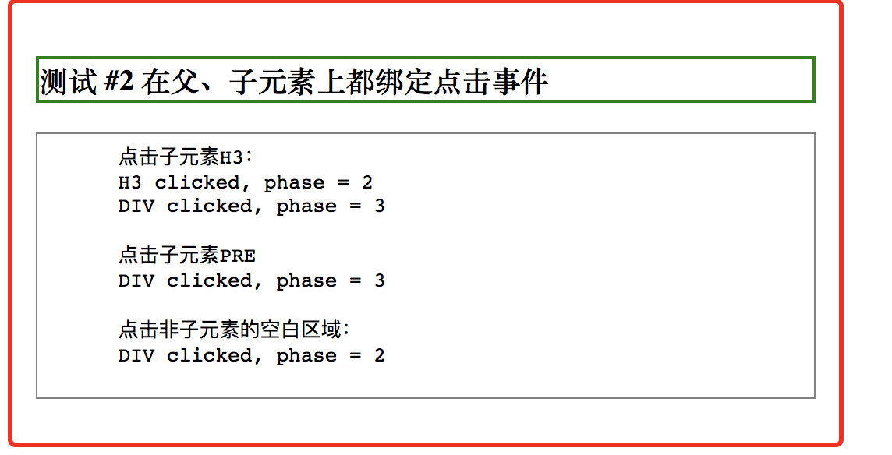
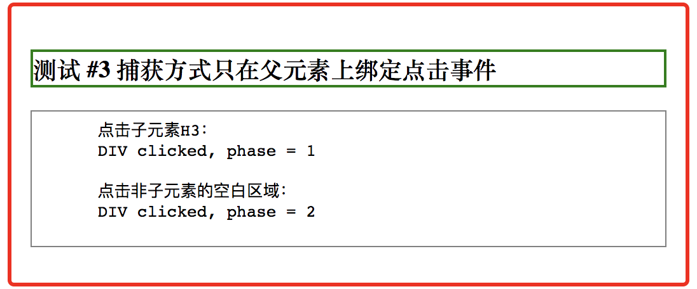
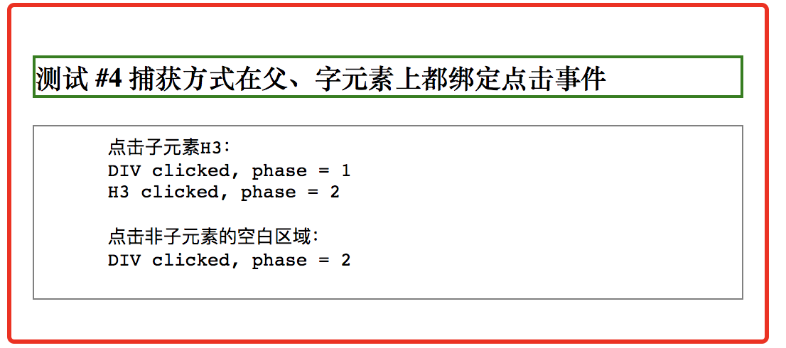

# 事件流的实用总结

对事件流的理解很浅，结合阅读的《JavaScript高级程序设计》和在项目中的应用，进行了一些实用的总结。


## 冒泡 vs 捕获

事件冒泡（event bubbling）是IE的提出的事件流，事件捕获（event capturing）是 Netscape Communicator提出的事件流叫。

事件流包含三个阶段：事件捕获阶段、处于目标阶段、事件冒泡阶段。不论哪种事件模型包含着三个阶段，差异在于在什么阶段处理事件。


我们就可以在事件的处理程序中，通过`event.eventPhase`来获取到处理程序所在的阶段：1-捕获 2-处于目标，3-冒泡阶段。


## 举个例子

先来个简单的例子：

（1）定义了一个 button，直接点击它，事件处理程序获取到的 event.eventPhase 是 2

（2）按钮内部有一个<i class="icon"></i>，点击按钮中的i，事件处理程序获取到的 event.eventPhase 是 3

（3）如果通过addEventListener指定第三个参数为true，采用事件捕获的事件流，点击按钮中的i，事件处理程序获取到的 event.eventPhase 是 1


为了方便直接看到结果，我们举例了四种情况，可以直观看到结果：

通用的样式效果：

```
<style>
  div {
    border: 3px solid red;
    padding: 15px;
    width: 500px;
    border-radius: 5px;
    margin-bottom: 5px;
  }
  h3 {
    border: 2px solid green;
  }
  pre {
    border: 1px solid gray;
    padding: 5px;
  }
</style>
```

通用的DOM结构长这样

```
<div>
  <h3></h3>
  <pre></pre>
</div>
```

### 1. 只在父元素上绑定点击事件




```
<div id="c1" onclick="handler(event)">
  <h3 id="t1"> 测试 #1 只在父元素上绑定点击事件</h3>
  <pre>
    点击子元素H3 或 PRE：
    DIV clicked, phase = 3

    点击其他空白区域：
    DIV clicked, phase = 2
  </pre>
</div>


<script>
  function handler(event) {
    console.log(event.currentTarget.nodeName + ' clicked, phase = ' + event.eventPhase);
  }
</script>
```


### 2. 在父、子元素上都绑定点击事件





```

<div id="c2" onclick="handler(event)">
  <h3 id="t2" onclick="handler(event)">测试 #2 在父、子元素上都绑定点击事件</h3>
  <pre>
    点击子元素H3：
    H3 clicked, phase = 2
    DIV clicked, phase = 3

    点击子元素PRE
    DIV clicked, phase = 3

    点击非子元素的空白区域：
    DIV clicked, phase = 2
  </pre>
</div>


<script>
  function handler(event) {
    console.log(event.currentTarget.nodeName + ' clicked, phase = ' + event.eventPhase);
  }
</script>
```


### 3. 捕获方式只在父元素上绑定点击事件





```
<div id="c3">
  <h3 id="t3">  测试 #3 捕获方式只在父元素上绑定点击事件</h3>
  <pre>
    点击子元素H3：
    DIV clicked, phase = 1

    点击非子元素的空白区域：
    DIV clicked, phase = 2
  </pre>
</div>

<script>
  function handler(event) {
    console.log(event.currentTarget.nodeName + ' clicked, phase = ' + event.eventPhase);
  }
  
  var c3 = document.getElementById('c3');
  c3.addEventListener('click', handler, true);
</script>
```

这一点最初有点没反应过来，虽然点击h3，事件流的第一阶段先到的div，会疑问为什么div的eventPhase不是2。还是要清楚一个核心概念，事件流是围绕着被点击的那个元素的概念，其他的元素只能在eventPhase为1或者3的阶段。

### 4. 只在父元素上绑定点击事件





```

<div id="c4">
  <h3 id="t4"> 测试 #4 捕获方式在父、字元素上都绑定点击事件</h3>
  <pre>
    点击子元素H3：
    DIV clicked, phase = 1
    H3 clicked, phase = 2
    
    点击非子元素的空白区域：
    DIV clicked, phase = 2
  </pre>
</div>


<script>
  function handler(event) {
    console.log(event.currentTarget.nodeName + ' clicked, phase = ' + event.eventPhase);
  }

  var c4 = document.getElementById('c4');
  var t4 = document.getElementById('t4');
  c4.addEventListener('click', handler, true);
  t4.addEventListener('click', handler, true);
</script>
```