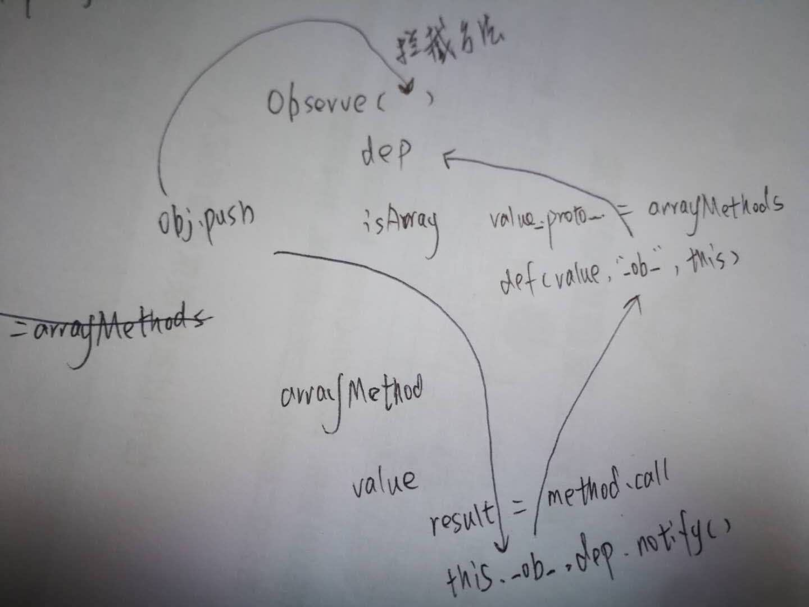

### 第2章 Object的变化侦测

#### 1.什么是变化侦测

变化侦测即数据状态的变化能同步到DOM中，实现上有pull和push两种方式。

Angular和React使用的是pull方式，它只能知道变了具体变化需要框架去暴力比对才能知道需要重新渲染的DOM元素（在Angular中使用的是脏检查，在React中使用的是虚拟DOM）。

Vue使用的是push，每个状态一变化就会推送，它的粒度很细，一旦数据发生变化，所有它的依赖（使用的DOM）都会更新。缺点是粒度太细了，开销会很大，在Vue2.0中采用了虚拟DOM，将力度调整为中等粒度，即每个状态绑定的是一个组件，状态变化后通知到组件，租价年内部在使用虚拟DOM进行对比。

#### 2. 如何追踪变化


可以使用Object.defineProperty 和 ES6的Proxy 来侦测变化。用前者来侦测变化会有一些缺陷，因此尤雨溪说会使用Proxy来重写变化侦测部分的代码。

#### 3. 如何收集依赖

把所有用到属性的地方收集起来（在getter中收集），在数据发生变化的时候触发依赖更新时师徒（在setter中触发）。

#### 4. 依赖收集在哪里

在set中将依赖关系收集到dep中：

```

function defineReactive(data, key, val) {
  let dep = new Dep();
  Object.defineProperties(data, key, {
    get: function(){
      dep.depend();
      return val;
    },
    set: function(newval) {
      if(val != newval) {
        if(val === newval) return;
        val = newval;
        dep.notify();
      }
    }
  })
}
```

将dep的常用操作抽象到一个单独的类当中：

```

export default class Dep {
  constructor(){
    this.subs = [];
  }

  addSub(sub) {
    this.subs.push(sub);
  }

  removeSub(sub) {
    this.removeSub(this.subs, sub);
  }

  depend() {
    if(window.target) {
      this.addSub(window.target);
    }
  }

  notify() {
    const subs = this.subs.slice();
    for (let i = 0; i < subs.length; i++) {
      subs[i].update();
      
    }
  }
}

function remove(arr, item) {
  if(arr.length) {
    const index = arr.indexOf(item);
    if(index > -1) {
      return arr.splice(index, 1);
    }
  }
}
```
#### 5. 依赖是谁

在上一节的代码中，收集的是 window.target，在实际使用中它可能是一个DOM，也可能是一个watch的语法，将这个依赖对象抽象成一个类起名为 Watcher。

#### 6. 什么是Watcher


Watcher是一个数据结构，传入要侦听的对象vm和要侦听的属性expOrFn，就可以把自己传递个属性的dep收集起来；当expOrFn属性值变化的时候，会被通知到要做对应的处理（在这里是调用cb函数）。如下代码，constructor给getter赋值后，随即用调用了get方法，会触发将自己添加到dep的逻辑。

```
export default class Watcher {
  constructor(vm, expOrFn, cb) {
    this.vm = vm;
    this.getter = parsePath(expOrFn);
    this.cb = cb;
    this.value = this.get();
  }

  get() {
    window.target = this;
    let value = this.getter.call(this.vm, this.vm);
    window.target = undefined;
    return value
  }

  update() {
    const oldValue = this.value;
    this.value = this.get();
    this.cb.call(this.vm, this.value, oldValue);
  }
}
```

parsePath则递归获取到属性的数据值，一个简单实现如下：

```
const bailRE = /[^w.$]/

export function parsePath(path) {
  if(bailRE.test(path)) return;
  const segments = path.split('.');
  return function (obj) {
    for (let i = 0; i < segments.length; i++) {
      if(!obj)return;
      obj = obj[segments[i]];
    }
    return obj
  }
}
```

#### 7. 递归侦听所有key

在入口属性下，挂载了复合对象，那么我们希望对象下的所有属性都能侦听到，如下定义的Observer类能满足这样的需求：

```
export default class Observer {
  constructor(value) {
    this.value = value;
    if(!Array.isArray(value)) {
      this.walk(value);
    }
  }

  walk(obj) {
    const keys = Object.keys(obj);
    for (let i = 0; i < keys.length; i++) {
      defineReactive(obj, keys[i], obj[keys[i]]);
    }
  }
}
```

对应地在defineReactive中开始位置，增加如下代码片段 

```
if(typeof val === 'object') {
    new Observer(val);
}
```

#### 8. 关于Object的问题

假定在Vue.js的实例中有一个obj对象，那么通过 `this.data.obj.name = 'newattr'`进行的操作是无非被侦听到的，delete一个属性也是同样的道理。这是因为Object.defineProperty只能侦听到属性是否修改，无法侦听属性是否被新增或删除。后续章节会介绍 `vm.$set`、`vm.$delete`的方法。


#### 9. 总结

本章介绍的所有概念的集合到图解





