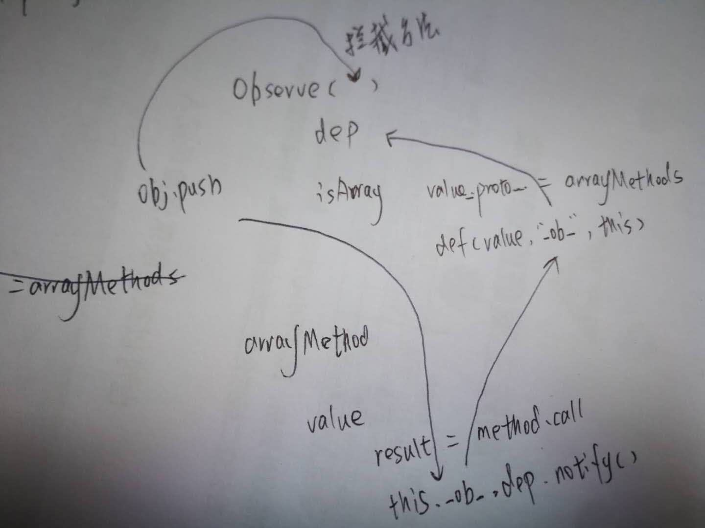

### 第3章 Array的变化侦测

修改对象属性会触发setter/getter，但是向Array中push一个元素是无法侦听到的，这也是为什么要单独处理Array的变化侦测。

#### 1. 如何追踪变化

ES6之前并没有方法能拦截原型的方法，因此通常使用拦截器来覆盖Array.prototype，即每次使用方操作数组，其实是使用的拦截器的方法。

#### 2. 拦截器

如下我们基于`Array.prototype`构建了一个对象`arrayMethods`，对象上直接定义了`push`方法，它会触发原型上的方法调用，在调用之前我们可以进行封装。

```
const arrayProto = Array.prototype;
export const arrayMethods = Object.create(arrayProto);

;['push'].forEach(function(method) {
  const original = arrayProto[method];
  Object.defineProperty(arrayMethods, method, {
    value: function mutator(...args){
      console.log('method:' + method + ' call')
      original.apply(this, args);
    }
  })
})
```

#### 3. 使用拦截器覆盖Array原型

在上一章中，我们会在Observer中，对对象调用walk方法，方法会对的对虾干所有属性进行遍历，进行defineReactive。

本节在Observer中，将上一节的arrayMethods，赋值给数组对象的 __proto__ 属性，从而直接覆盖对象的原型。

```
export default class Observer {
  constructor(value) {
    this.value = value;
    if(Array.isArray(value)) {
      value.__proto__ = arrayMethods;      
    } else {
      this.walk(value);
    }
  }
  ...
}
```

#### 4. 将拦截器方法挂载到数组的属性上

在某些环境下无法获取到对象下的`__proto__`，这时可以遍历`arrayMethods`中的方法，然后复制到对象上。因为只属于兼容性的处理，不影响理解主流程，这里不再赘述，有需要可以参考对应的章节。

#### 5. 如何收集依赖


拦截器能在数组发生方法调用时拥有被通知到的能力。对象中属性值不管是什么类型，只要有引用，就必然会触发getter，收集依赖同样是在getter中。复习一下：这里的依赖收集，就是向`Dep`对象（每个`key`中都对应一个`Dep`对象）中`push`对应的依赖（Watcher）。

#### 6. 依赖列表存在哪儿

在Observer的构造函数中，增加如下一行
```
export default class Observer {
  constructor(value) {
    this.dep = new Dep();
    ...
  }
  ...
}
```

#### 7.收集依赖


在defineReactive的首行，修改构造Observer实例的方法，将

```
function defineReactive(data, key, val) {
  if(typeof val === 'object') {
    new Observer(val);
  } 
  ...
}
```

改造成了

```
function defineReactive(data, key, val) {
  let childOb = observe(val);
  ...
}

export function observe(value) {
  if(typeof value != 'object') return;

  let ob;
  if(value.hasOwnProperty('__ob__') && value.__ob__ instanceof Observer) {
    ob = value.__ob__;
  } else {
    ob = new Observer(value);
  }
  return ob;
}
```


#### 8.　在拦截器中获取Observer实例

在Observer中，我们通过增加将Observer实例挂载在监听对象的 `__ob__` 属性上

```
export class Observer {
  constructor(value) {
    ...
    def(value, '__ob__', this)
    ...
  } 
}
```

其中def做的事情就是在使用`Object.defineProperty`在对象`value`上定义一个`__ob__`属性

在使用`Object.defineProperty`对`arrayMethod`对各个操作数组的方法

#### 9.　向数组的依赖发送通知

在触发器中就可以获取到对象上挂载的Observer对象，然后再拿到dep对象通知watcher的回调。

```
const arrayProto = Array.prototype;
export const arrayMethods = Object.create(arrayProto);

;['push'].forEach(function(method) {
  const original = arrayProto[method];
  Object.defineProperty(arrayMethods, method, {
    value: function mutator(...args){
		const result = original.apply(this, args);
		const ob = this.__ob__;
		ob.dep.notify();
    }
  })
})
```

#### 10.　侦测数组中元素的变化

对于全面的内容可大概总结下：我们给Array类型的方法，增加了拦截，每当通过`push`改变数组结构的行为发生时候可以侦听到。

本节介绍的是数组中包含了子对象的时候，如何侦听子对象中属性的变化，即在Observer的构造函数中，针对isArray的情况增加一个处理

```
export default class Observer {
  constructor(value) {
    this.value = value;
    if(Array.isArray(value)) {
      value.__proto__ = arrayMethods;      
      this.observeArray(value);
    } else {
      this.walk(value);
    }
  }
  ...
  observeArray(items) {
	for (let i = 0; i < items.length; i++) {
      observe(items[i]);
    }
  }
}
```

#### 11.　侦测新增元素的变化

通过方法新增的元素，也要转换成响应式来侦测变化。


##### 获取新增元素

在arrayMethods的拦截中，通过`args`即可拿到新元素的数组


##### 使用Observer侦测新增元素

通过 `ob = this.__ob__`已经拿到挂载数组对象下的Observer，在通过`ob.reserveArray(args)`即可。

个人备注：此种情况只适合对新增对象进行响应式，对于普通的数据类型理论上是无法做到侦听的。

#### 12.关于Array的问题

因为我们是通过拦截数组原型上的方法来实现侦听，因此如下两种操作方式是无法实现到侦听的：

```
this.list.length = 0;
this.list[0] = 2;
```

#### 13. 总结




