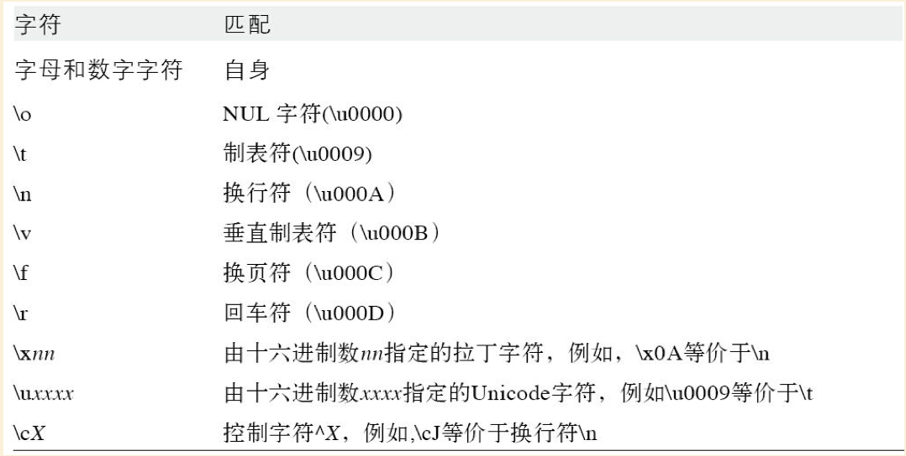
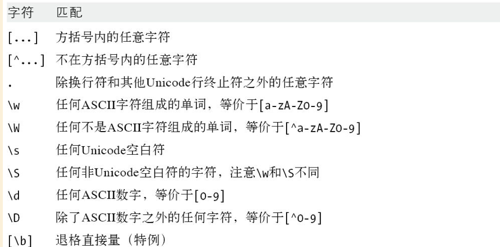
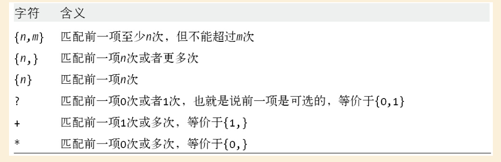
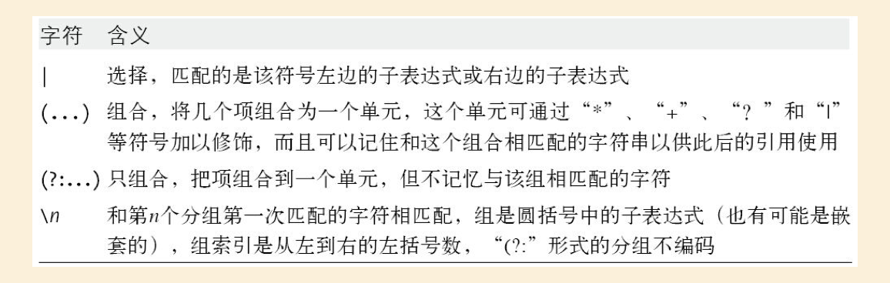
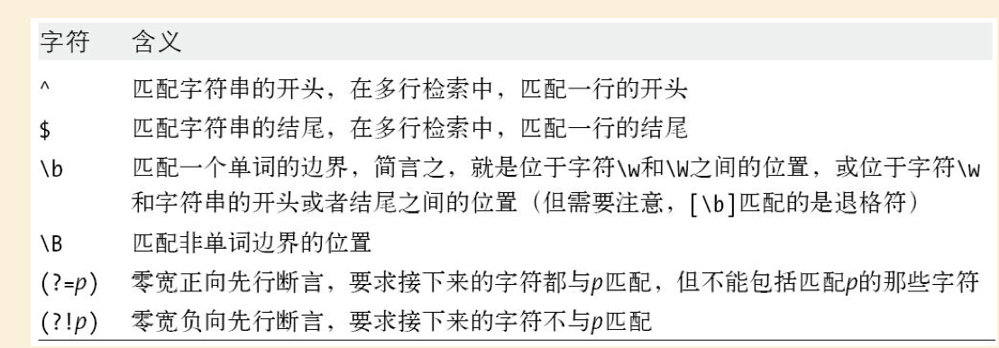
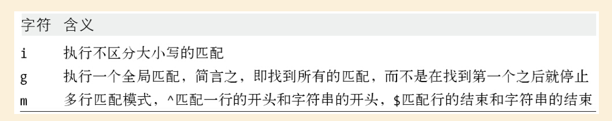

# JavaScript权威指南-第6版

# 第一部分

# 第10章 正则表达式和模式匹配

## 容易混淆的复杂概念总结

###（1） `?:`分组

出现在该表达式后面的字符，不会出现在匹配结果的编组中。

例如下面例子中，`(\.)`因为有括号括起来，也会出现在编组中，结果的第三项为`.`。

```
"http://www.baidu.com".match(/(\w+)(\.)/)

["www.", "www", ".", index: 7, input: "http://www.baidu.com", groups: undefined]
```

稍加修改，可以看到 `.` 不会在出现匹配结果中

```
"http://www.baidu.com".match(/(\w+)(?:\.)/)

(2) ["www.", "www", index: 7, input: "http://www.baidu.com", groups: undefined]
```
###（2）`?=`向前断言、`?<=`向后断言

我们可以通过如下表达式直接不通过分组直接匹配出带`.com`结尾的`baidu`这部分：

```
"http://www.baidu.com".match(/\w+(?=\.com)/);

["baidu", index: 11, input: "http://www.baidu.com", groups: undefined]
```

`?=`确保的是表达式`\w+`前面（书写顺序）这部分是符合要求，但是不出现在匹配结果中的。

同理，我们可以通过如下表达式匹配出 `www.`打头的部分

```
http://www.baidu.com".match(/(?<=www\.)\w+/);

["baidu", index: 11, input: "http://www.baidu.com", groups: undefined]
```
`?<=`确保的是向后部分`www.`是匹配的

### （3）str.match方法参数使用g和不使用g

不使用g，会返回一个数组结果，如上：它包含匹配结果的分组、index、input属性。操作。

而使用g，会返回所有的匹配结果，例如：

```
"http://www.baidu.com".match(/\w+\./g);

["www.", "baidu."]
```

## 10.1 正则表达式的定义

RegExp是用于表示正则表达式的类，可以使用直接量或RegExp两种方式创建正则表达式。

### 直接量字符

通过反斜杠`\`可以让表达式中的字符按照非字母进行匹配，如下列举了转译字符：



`^$.*+?=!:|\/()[]{}` 是有特殊含义的标点符号，其中某些符号只在一定的上下文中才有特殊含义，其他情况直接被当成直接量。

想要在表达式中使用这些字符当做直接量，需要在前面加前缀`\`。其他的标点符号比如@在正则表达式中按照字面含义进行匹配。

标点符号如果不记得是否需要转译，可以都加上反反斜杠；另外字母和数字如果使用了反斜杠转移会有特殊的含义，尽量不要使用反斜杆。

### 字符类

将直接量放进方括号内就组成了字符类，字符类可以匹配它所包含的任意字符。

/[abc]/ 会与任意一个a, b, c中的任意一个字符匹配
/[^abc]/ 会匹配a, b, c之外的所有字符
/[a-zA-Z0-9/ 会匹配拉丁字母表中任何字母和数字

有一些特殊的字符转义后可以表示其他含义：



疑问：关于ASCII字符的描述，还是不理解，它如何判定字符是ASCII字符。

### 重复

下表列举了表示重复的语法



这里有一些例子

```
/\d{2,4}/ //匹配2~4个数字
/\w{3}\d?/ //精确匹配三个单词和一个可选的数字
/\s+java\s+/ //匹配前后带有一个或多个空格的字符串
"java"/[^(]*/ //匹配一个或多个非左括号的字符
```

**非贪婪的重复**

上述的例子都是贪婪的匹配，即会尽可能匹配多的字符，通过在后面加上`?`我们可以让表达式变成非贪婪的。比如 `aaab` 在用 `a+?b` 会匹配尽可能少的`a`和一个`b`。但实际上还是有一些偏差的，最终匹配的是整个字符串，因为匹配算法总是寻找第一个可能匹配的位置。

### 选择、分组和引用

字符`|`用于分隔可选择的字符，一旦发现了左边的匹配项就会忽略右边的匹配项。

`()`有多种用途，包括

（1）把单独的项组合成子表达式，然后可以当做独立的单元处理

（2）在完整的模式中定义子模式，

（3）在统一表达式中，引用前面的子表达式，比如 `/(['"])[^'"]*\1/`

如果想让 `()` 中的字符不加入编组，可以使用 `(?:)`。




### 指定匹配位置


像`\t`这样不匹配可见字符的元素称为锚。最常用的锚是 `^` 用来匹配字符串的开始，`$`用以匹配字符串的结束。

值得进行介绍的是`\b`，代表单词的边界，假定使用 `\sJava\S`表达式，直接匹配 `'Java'`会失败，因为它出出现在了开始和结束位置；另外去匹配 `' Java '` 虽然能通过，但是匹配出来内容是包含了空格的。使用 `/\bJava\b/`可以避免这个问题。

`(?=)`代表着必须匹配`=`号后面的内容，但是匹配的子字符中不包含该内容。



### 修饰符




## 10.2 用于模式匹配的方法

本节介绍String对象中用于正则表达式匹配 和 检索替换的方法。

### search

用法`str.search(regexp)`，参数是正则表达式，返回匹配的起始位置。如果参数不是正则表达式，则会先通过RegExp将构参数转化为正则表达式。search方法不支持全局检索，会忽略修饰符`g`。

### replace

`str.replace(regexp|patternStr, replaced)` 

如果表达式中设置了修饰符`g`，则所有匹配的字符都会被替换，如果第一个参数不是正则表达式，方法将直接搜索字符串，而不会将其转化为正则表达式。


replace包含的一个更强大的用法是，它可以通过 `$`后加数字 指定匹配的子表达式， 如下例子可以替换双引号为中文引号：

```
var quote = /"([^"]*)"/g;
var str = 'He say: "why are you so late?"'
str.replace(quote, '“$1“');
He say: “why are you so late?“
```

在本书的第三部分会介绍，replace的第二个函数可以是函数，它能动态地替换字符串。

### match

`str.match(regexp)`

它的参数是正则表达式或者被转成RegExp的字符串，返回一个匹配结果组成的数组，如果设置了修饰符`g`则返回所有匹配结果。返回的第一个结果是完整的匹配，后续是用圆括号括起来的匹配子串。


如下例子解析了一个URL

```
var url = /(\w+):\/\/([\w.]+)\/(\S*)/;
var text="Visit my blog at http://www.example.com/~david";
var result=text.match(url);
if(result!=null){
	var fullurl = result[0];//包含"http://www.example.com/~david"
	var protocol=result[1];//包含"http"
	var host=result[2];//包含"www.example.com"
	var path=result[3];//包含"~david"
}
```

### split

`str.split(patternStr|regexp)`

本书第三部分有关于该方法的其他特性的介绍。

## 10.3 RegExp对象

本节介绍RegExp对象的三个方法和一些属性。

RegExp对象对象接收两个字符串参数，第二个为可选。第一个参数，需要使用转义字符时，需要再使用一个`\`作为前缀，比如：

```
var zipCode = new RegExp("\\d{5}", 'g')
```

### RegExp属性

- source，可读的字符串，包含正则表达式的文本
- global，是否带有修饰符g
- ignoreCase，是否带有修饰符i
- multiline，是否带有修饰符m
- lastIndex，可读可写的证书，在使用g修饰符匹配时，存储下一次检索的开始位置

### RegExp方法


#### regex.exec(str)

匹配了以后会返回一个跟match一样的结构，没匹配则返回null，返回结果中还包含了 input 和 index属性，index包含发生匹配的字符位置，input引用 是正在检索的字符串。

和match()不同的是，不管是否有修饰符g，它都返回一样的数组。但是当使用了g修饰符，它的lastIndex为匹配子串的位置，每一次执行都将从lastIndex的位置设置为子串后的位置，并从该位置开始检索。

```
var pattern = /Java/g;
var text = "JavaScript is more fun than Java!";
var result;
while((result = pattern.exec(text)) != null) {
    console.log("Mathced '" + result[0] + "'" + " at position " + result.index + "; next search begins at " + pattern.lastIndex);
}

// Mathced 'Java' at position 0; next search begins at4
// Mathced 'Java' at position 28; next search begins at32
```

#### regex.test(str)

它的返回结果和exec等价。


