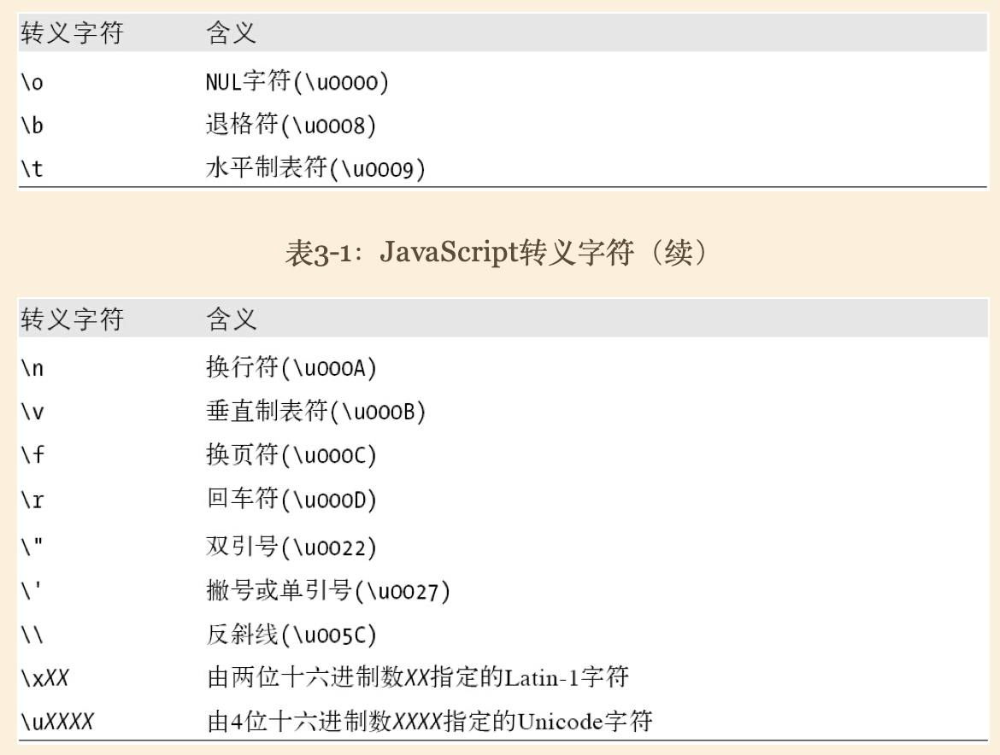
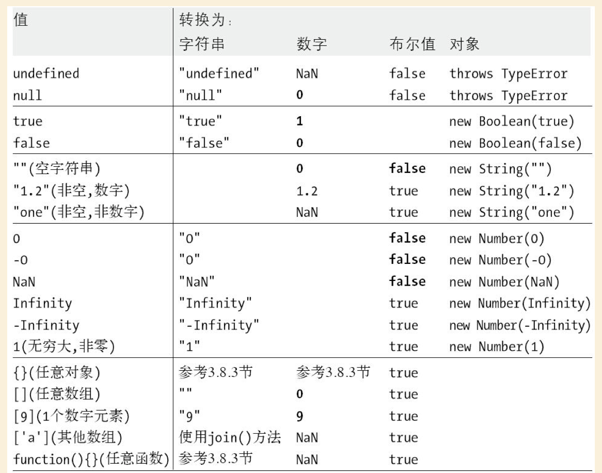

# JavaScript权威指南-第6版

# 第一部分

# 第3章 类型、值和变量

## 3.1 数字

### 整型直接量

用数字序列表示一个十进制正式，也可以使用 `0x` 或者 `0X` 表示一个十六进制，ECMAscript标准不支持八进制直接量，但在某些实现中支持，它以`0`开始。

### 浮点型直接量

浮点数可以使用 `[整数部分][小数点][小数部分]` 组成，也可以使用浮点技术法表示  `[实数][e|E][+|-][整数]` 表示，例如

```
6.02e23 // 6. 02 × 1023
```

### JavaScript中的算术运算

除了加减乘除求余之外，通过Math对象的属性可以获得更复杂运算的能力。

比较特殊的介绍在 overflow、underflow、被零整除时候的情况

#### overflow

数字超过能表示的最大边界，会用 Infinity 表示，负数则用 - Infinity表示。基于它的加减乘除运算还是一样的结果。

#### underflow

运算结果无限接近于零并且比JavaScript所能表示的最小的值还小时，JavaScript会返回0，当数字为负数的时候为-0。0和-0除了用在除法中，几乎完全一样（0===-0。

#### 被零整除

在JavaScript中被零整除不会报错，它只是简单地返回无穷大（Inifinity）或者（-Infinity）。

特殊的零除以零是没有意义的，返回NaN。NaN比较特殊，和任何值都不相等（包括自身），需要使用isNaN来判断（实现方式为x!=x)


### 二进制浮点数和四舍五入错误

JavaScript能表示的浮点数个数是有限的，因为它采用的是二进制表示法，可以精确表示1/2 1/4 1/8，常用的1/10却无法精确表示。结果就是一些计算结果不符合预期：

```
var x = .3 - .2; // 30 美分 减去 20 美分 
var y = .2 - .1; // 20 美分 减去 10 美分 
x == y // => false: 两 值 不相等! 
x == .1 // => false: .3-. 2 不等于 .1 
y == .1 // => true: .2-. 1 等于 .1
```

因此你可能更愿意使用整数“分” 而不是小数“元”来进行计算。

### 日期和时间

这里提供了一个日期计算的简单教程

```
var then = new Date( 2011, 0, 1); // 2011 年 1 月 1 日 
var later = new Date( 2011, 0, 1, 17, 10, 30);// 同一 天, 当地时间 5: 10: 30pm, 
var now = new Date(); // 当前 日期 和 时间 
var elapsed = now - then; // 日期 减法： 计算 时间 间隔 的 毫秒 数 
later. getFullYear() // => 2011 
later. getMonth() // => 0: 从 0 开始 计数 的 月份 
later. getDate() // => 1: 从 1 开始 计数 的 天数 
later. getDay() // => 5: 得到 星期 几， 0 代表 星期日， 5 代表 星期一 
later. getHours() // => 当地时间 17: 5pm 
later. getUTCHours() // 使用 UTC 表示 小时 的 时间， 基于 时区
```

## 3.2 文本

字符串由一组由16位（2字节）值组成的不可变的有序序列，字符串长度为所含16位值的个数。

JavaScript用UTF-16编码的Unicode字符集，常用字符用16位内码表示，不能表示为16位的字符则用两个16位值组成的序列表示，这意味着一个字符从长度成为了2。

注：在阮一峰的文章中，说到JavaScript是用UCS-2进行编码的，而UTC-16是UCS-2的超集。语言到底是用的什么标准？

JavaScript中的字符方法是基于16位值，而非字符；在ES6中增加了一些方法(String.getCodePointAt等) 和 遍历属性（for...of)。

### 字符串直接量

ES3中字符必须写在同一行，ES5中可以使用`\`将字符拆成若干行书写(实际展示还是紧凑的字符)，希望字符串直接另起一行可以使用 `\n`。字符用单双引号括起来，和字符串内部引号冲突时，可以使用`\`转译。

### 转译字符

使用反斜杠可以使我们避免使用常规方式来解释一些字符。





一个通用规则是，使用 `\x` 表示Latin-1中的字符，使用`\u`表示Unicode中的字符 

```
"\xA9" //©
"\u03C0" //π
```


### 字符串的使用

字符串是不可变的，很多操作字符串的方法都是返回的新字符串。

可以使用 `+` 来拼接字符串，可以使用`.length`来获取字符串长度，还有很多可供调用方法：

```

var s = "hello, world" // 定义 一个 字符串 
s. charAt( 0) // => "h": 第一个 字符 
s. charAt( 
s. length- 1) // => "d": 最后 一个 字符 
s. substring( 1, 4) // => "ell": 第 2~ 4 个 字符 
s. slice( 1, 4) // => "ell": 同上 
s. slice(- 3) // => "rld": 最后 三个 字符 
s. indexOf(" l") // => 2: 字符 l 首次 出现 的 位置 
s. lastIndexOf(" l") // => 10: 字符 l 最后 一次 出现 的 位置 
s. indexOf(" l", 3) // => 3: 在 位置 3 及之 后 首次 出现 字符 l 的 位置 
s. split(", ") // => ["hello", "world"] 分割 成 子串 
s. replace(" h", "H") // => "Hello, world": 全文 字符 替换 
s. toUpperCase() // => "HELLO, WORLD"

```

### 模式匹配

JavaScript定义了RegExp这个文本匹配对象，在String和RegExp中都定义了一些用于匹配的函数。

```

var text = "testing: 1, 2, 3"; // 文本 示例 
var pattern = /\d+/ g // 匹配 所有 包含 一个 或 多个 数字 的 实例 
pattern. test( text) // => true: 匹配 成功 
text. search( pattern) // => 9: 首次 匹配 成功 的 位置 
text. match( pattern) // => ["1", "2", "3"]: 所有 匹配 组成 的 数组 
text. replace( pattern, "#"); // => "testing: #, #, #" 
text. split(/\ D+/); // => ["","1"," 2"," 3"]: 用 非 数字 字符 截取 字符串

```


## 3.3 布尔值

任意JavaScript的值都可以转换为布尔值。下面这些值会被转换成false：

```
undefined
null
0
-0
NaN
""  // 空字符串
```

所有其他值，包括所有对象（数组）都会转换成true。

## 3.4 null和undefined


null是JavaScript语言的关键字，它表示一个特殊值，常用来描述“空值”。对null执行typeof预算，结果返回字符串“object”，也就是说，可以将null认为是一个特殊的对象值，含义是“非对象”。

undefined是预定义的全局变量（它和null不一样，它不是关键字），它的值就是“未定义”。在ECMAScript 3中，undefined是可读/写的变量，可以给它赋任意值。这个错误在ECMAScript 5中做了修正，undefined在该版本中是只读的。如果使用typeof运算符得到undefined的类型，则返回“undefined”。

undefined即未定义的值表示更深层次的“空值”。

## 3.5 全局对象

全局对象的属性是全局定义的符号JavaScript程序可以直接使用。

- ·全局属性，比如undefined、Infinity和NaN 
- ·全局函数，比如isNaN（）、parseInt（）（见3.8.2节）和eval（）（见4.12节） 
- ·构造函数，比如Date（）、RegExp（）、String（）、Object（）和Array（）（见3.8.2节） 
- ·全局对象，比如Math和JSON（见6.9节）

2.4.1节列举了全局对象，本章和其他章节都会讲道它们。第三部分可以找到它们，第四部分还可以看到在window下额外增加的全局属性。


代码的最顶级可以用this来获取到全局对象的信用，在客户端JavaScript中，全局Window对象有一个属性window引用其自身，它可以代替this来引用全局对象。

## 3.6 包装对象

只要引用了基本类型的属性，基本类型会被转化成对象，并拥有对象的方法。过程中伴随着包装对象的新建 以及使用在属性之后被销毁。因此在下面的属性设置通常是无效的。

```
var s =  "test";  //创建一个字符串
s.len =  4;       // 给它设置一个属性
var t =  s.len;   //  查询这个属性
```

当然也可以通过new String()、Number()、Boolean()显式创建包装对象。但它们和原始数值并不表现地相同，用typeof运算符，以及===都可以看出差异。

## 3.7 不可变的原始值和可变的对象引用

原始值是基于值得比较，对象值是基于引用的比较。

```
'123'==='123'//true
```

## 3.8 类型转换

类型转换发生在，程序期望某个类型数据，而实际格式不符的时候，下面是一些例子：

```
10 + " objects" // => "10 objects". 数字 10 转换 成 字符串 
"7" * "4" // => 28: 两个 字符串 均 转换 为 数字 
var n = 1 - "x"; // => NaN: 字符串" x" 无法 转换 为 数字 
n + " objects" // => "NaN objects": NaN 转换 为 字符串" NaN"

```

下图中的表格列举了JavaScript中类型转换的规则，其中加粗部分是让人感到意外的类型转换：



转换类型可以简单进行分类：

- 原始值到原始值的转换
	- `"" => false`
	- 合规的字符串（两边带空格的）可以转化为数字，两头有非数字的组成部分的则会变成NaN
- 原始值到对象的转换
	- 简单通过new String()、Number()、Boolean(）转化为包装对象
	- null和undefined试图转成对象会造成TypeError
- 对象到原始值的转换
	- 比较复杂，将在3.8.3节专门介绍

### 3.8.1 转换和相等性

灵活的类型转换发生在`==`运算符中，它会将左右两边的变量转化后进行对比：

注：阅读后续内容后，反而对下面的规则不能理解，姑且理解为后面是对象类型的转化。

```
null == undefined // 这 两 值 被认为 相等 
"0" == 0 // 在 比较 之前 字符串 转换 成 数字 
0 == false // 在 比较 之前 布尔 值 转换 成 数字 
"0" == false // 在 比较 之前 字符串 和 布尔 值 都 转换 成 数字
```	

在另外一个场景  `if(undefined) {}` 中，`undefined` 被转化为了`false`，并不意味着 `undefined == false`。

### 3.8.2 显式类型转化


#### 函数手动转化

显式类型转化最简单的办法是使用Number()、String()、Boolean()、Object()函数。

```
Number("3");// Number(3)
String(false);//"false"
Boolean([]);//true
Object(3)//Number(3)
```

注意事项：


- 除了null和undefined的任何值都有toString方法，返回值和String()方法返回的一致。
- 把null和undefined转化为对象会抛出TypeError，Object则会简单地返回一个空对象。

#### 运算符导致的转化

- + 运算符的一个操作符是字符串，则会把另一个操作数也转化为字符串
- 一元 + 运算符会将其操作数转化为数字
- 一元 ! 运算符会将操作数转化为布尔值并取反

#### 使用函数在 数字/字符串 之间做精准转化

**数字到字符串**

- 使用`toString(进制)`获取指定进制的字符
- 使用`toFixed(保留位数)`获取到保留到小数点后若干位的小数
- 使用`toExponential(小数点后的位数)`将数字转化为指数表示
- 使用`toPrecision(有效位)`将指定的有效位将数字转换为字符串


```
var n = 123456. 789; 
n. toFixed( 0); // "123457" 
n. toFixed( 2); // "123456. 79" 
n. toFixed( 5); // "123456. 78900" 
n. toExponential( 1); // "1. 2e+ 5" 
n. toExponential( 3); // "1. 235e+ 5" 
n. toPrecision( 4); // "1. 235e+ 5" 
n. toPrecision( 7); // "123456. 8" 
n. toPrecision( 10); // "123456. 7890"
```

**字符串到数字**

- Number(string)只能基于十进制转化为整数或浮点数，非法格式不能识别
- parseInt() 解析为整数，前缀是0x或0X会被解析为十六进制，第二个参数可以指定转换基数
- parseFloat() 解析为整数和浮点数

parseInt()/parseFloat()和都会忽略前导空格并解析尽可能多的字符，忽略后面的无效内容（这一点和Number()不通过），第一个非空格字符是非法的数字直接量，会返回NaN。

```
parseInt(" 3 blind mice") // => 3 
parseFloat(" 3. 14 meters") // => 3. 14 
parseInt("- 12. 34") // => -12 parseInt(" 0xFF") // => 255 
parseInt(" 0xff") // => 255 
parseInt("- 0XFF") // => -255 
parseFloat(". 1") // => 0. 1 
parseInt(" 0. 1") // => 0 
parseInt(". 1") // => NaN: 整数 不 能以"." 开始
parseFloat("$ 72. 47"); // => NaN: 数字 不 能以"$" 开始

parseInt(" 11", 2); // => 3 (1* 2 + 1) 
parseInt(" ff", 16); // => 255 (15* 16 + 15) 
parseInt(" zz", 36); // => 1295 (35* 36 + 35)
parseInt(" 077", 8); // => 63 (7* 8 + 7) 
parseInt(" 077", 10); // => 77 (7* 10 + 7)
```

### 3.8.3 对象转换为原始值

#### a. 对象到布尔值

全都转换为true

#### b. 对象到字符串/数字转换

注意：下面介绍的规则只适用于本地对象，宿主对象有各自的转换算法。

所有对象继承了toString()和valueOf()方法

**toString()方法**

默认对象上调用会返回`[object Object]`，各个类（比如Array）则都实现了特定版本的toString()返回比较具有可读性的内容：

```
[1, 2, 3]. toString() // => "1, 2, 3" 
(function( x) { f( x); }).toString() // => "function( x) {\n f( x);\ n}" 
/\d+/ g. toString() // => "/\\d+/ g" 
new Date( 2010, 0, 1). toString() // => "Fri Jan 01 2010 00: 00: 00 GMT- 0800 (PST)"
```
**valueOf()方法**

语言对该方法的任务没详细定义。它的作用是，如何存在任意原始值，它就将默认对象转换为原始值。

大多数对象是复合值，无法简单表示为原始值，因此将直接返回自身。

**转化规则**

注意：Number('1') 和 new Number('1') 是不用的，一个转化数字，一个新建了一个包装对象。

（1）对象到字符串


```
if o.toString
	if o.toString() is 原始值
		return String(o.toString())
	else if o.valueOf
		if o.valueOf() is 原始值
			return String(valueOf())
else if o.valueOf
	if o.valueOf() is 原始值
		return String(valueOf())
else 
	TypeError	
```

（2）对象到数字

```
if o.valueOf
	if o.valueOf() is 原始值
		return Number(o.valueOf())
	else if o.toString
		if o.toString() is 原始值
			return Number(o.toString())
else if o.toString
	if o.toString() is 原始值
		return Number(o.toString())
else 
	TypeError	
```

```
//[] == 0 的转化过程

[] 
valueOf([]) // []
toString([])  // ''
Number('') // 0

//[2] == 2 的转化过程

[2] 
valueOf([2]) // [2]
toString([2])  // '2'
Number('2') // 2
```

**+和其他运算符**

+运算符可以执行算术运算 和 将字符串相连。

如果一个运算数是对象，则会特殊的方法将其转化为原始值（此处应该是字符串），而不像其他运算符那样实现对象到数字的转化（言下之意其他运算符是将对象转化为数字。比如 `<` 和 `-` 运算符会先转化为数字）。 ==运算符与此规则相似；同样使用 `==` `!=` 将对象和原始值比较，会将对象先转化为原始值。

```
[1]+1 // '11'
[1]-1 / /0
```

**日期的转换**

日期对象到原始值的转化采用的是到字符串的转化模式，即先采用toString()，并且通过toString()或valueOf()的返回值将被直接使用，而不再转化为字符串或数字。

```
var now = new Date(); // 创建 一个 日期 对象 
typeof (now + 1) // => "string": "+"将 日期 转换 为 字符串 
typeof (now - 1) // => "number": "-"使用 对象 到 数字 的 转换 
now == now. toString() // => true: 隐式 的 和 显 式 的 字符串 转换 
now > (now -1) // => true: ">"将 日期 转换 为 数字
```


## 3.9 变量声明

如下是常见的合法声明：

```
var  i;
var  sum;

var  i,sum; 
var  message =  "hello";
var i =  0, j =  0, k =  0;

for(var i =  0; i <  10;  i++)  console.log(i);

for(var i =  0,  j=10; i <  10;  i++,j--)  console.log(i*j);

for(var p  in  o)  console.log(p);
```

重复声明仅相当于对变量重复进行了赋值，遗漏的声明会被挂在全局对象下（在ES5严格模式下则会报错）。

## 3.10 变量作用域

### 函数作用域和声明提前

在一些编程语言中，花括号内的每一段代码都具有各自的作用域，而且变量在声明它们的代码段之外是不可见的，称为块级作用域（block  scope）。

JavaScript中没有块级作用域，取而代之地使用了函数作用域（function  scope）：变量在声明它们的函数体以及这个函数体嵌套的任意函数体内都是有定义的。

JavaScript的这个特性被非正式地称为声明提前（hoisting），即JavaScript函数里声明的所有变量（但不涉及赋值）都被“提前”至函数体的顶部，看一下如下代码： 

```
var  scope =  "global";
function  f() {
  console.log(scope);    //  输出"undefined"，而不是"global"
  var  scope =  "local"; //  变量在这里赋初始值，但变量本身在函数体内任何地方均是有定义的
  console.log(scope);    //  输出"local"
}
```

另外举一个实际开发遇到的例子，可能涉及一些ES6 let的用法：

```
function test(index) {
console.log(index);
var index = 1;
}
test(0); // 0 
```

```
function test(index) {
console.log(index);
let index = 1; 
}
test(0); // Uncaught SyntaxError: Identifier 'index' has already been declared
```

### 作为属性的变量


当声明一个JavaScript 全局变量时，实际上是定义了全局对象的一个属性（见3. 5 节）。当使用var 声明一个变量时，创建的这个属性是不可配置的（见6. 7 节），也就是说这个变量无法通过delete 运算符删除？

```
var  truevar =  1;         //  声明一个不可删除的全局变量
fakevar =  2;             //  创建全局对象的一个可删除的属性
this.fakevar2 =  3;       //  同上
delete  truevar           //  =>  false:  变量并没有被删除
delete  fakevar           //  =>  true:  变量被删除
delete  this.fakevar2     //  =>  true:  变量被删除
```

JavaScript全局变量是全局对象的属性，这是在ECMAScript规范中强制规定的。对于局部变量则没有如此规定，但我们可以想象得到，局部变量当做跟函数调用相关的某个对象的属性。ECMAScript 3规范称该对象为“调用对象”（call  object），ECMAScript 5规范称为“声明上下文对象”（declarative environment  record）。

JavaScript可以允许使用this关键字来引用全局对象，却没有方法可以引用局部变量中存放的对象。这种存放局部变量的对象的特有性质，是一种对我们不可见的内部实现。然而，这些局部变量对象存在的观念有助于我们理解作用域链。


### 作用域链

层层上溯找声明，不赘述。


