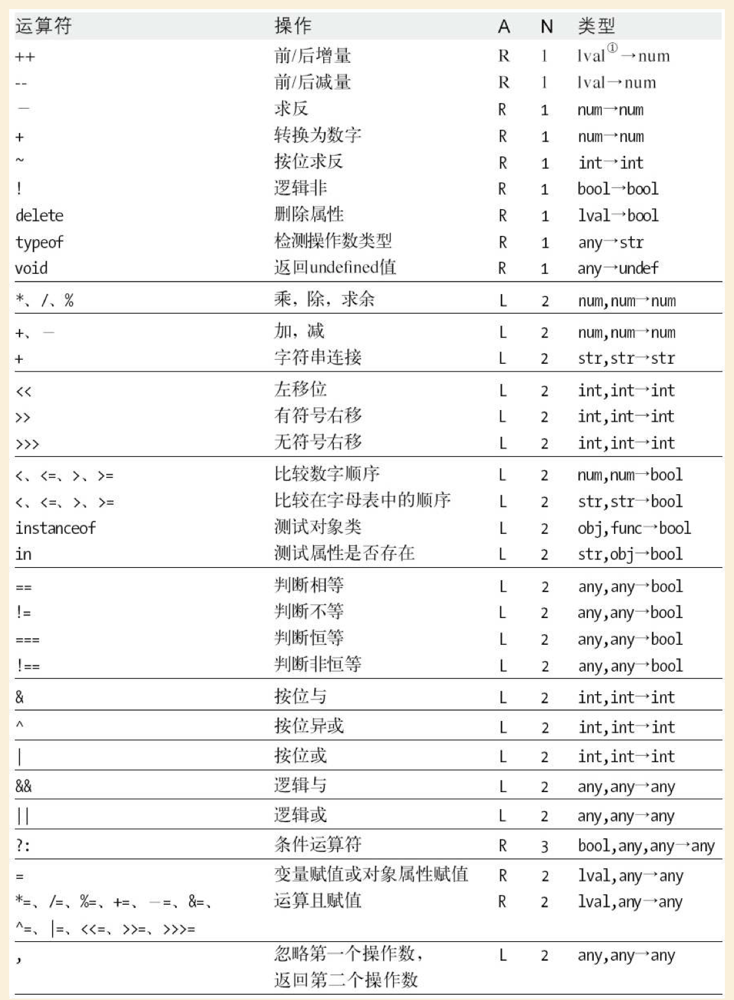
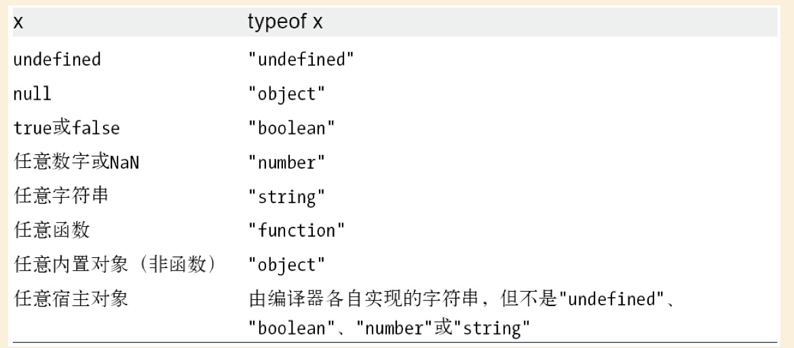

# 第4章 表达式和运算符

简单表达式通过运算符组合成复杂表达式，当然也有不涉及运算符的表达式（比如数组取值和函数调动）。

## 4.1 原始表达式

作为表达式的最小单位，通常不再包含其他表达式，它包含常量/直接量(`123`)，关键字(`true `)、变量(`undefined/sum`)。

## 4.2 对象和数组的初始化表达式

它们表示新创建的对象(`{name: 'yefei'}`)或数组(`[[1,2,3],,3,]`)。

## 4.3 函数定义表达式

定义一个JavaScript函数，也可以成为对象直接量。

```
var square = function(x) {return x*x}
```

## 4.4 属性访问表达式

有两种方式可以访问属性，其中`[]`适用于一些动态变化的属性 以及 属性名比较特殊的情况。

```
var o = {x:1, '.':2}
o.x
o[x]
o['.']
```

## 4.5 调用表达式

调用表达式是调用函数或方法的表示

```
f()
Math.max(x,y)
a.sort()
```

## 4.6 对象创建表达式


对象创建表达式创建一个对象并调用一个函数（称为构造函数）来初始化新对象的属性。

对象创建表达式和函数调用表达式非常类似，只是多了一个 `new`关键字。

如果构造对象不需要参数，括号是可以省略的:

```
new Object()
new Point(2,3)
new Date
```
第9章将介绍构造函数的细节。

## 4.7 运算符概述



#### 结合性

结合性指定了在多个具有同样优先级的运算符表达式中的运算顺序。

从左至右是指运算：

`w = x - y - z;`

和下面一模一样

w = ((x - y) - z); 

从右至左是指运算：

```
x = ~- y; 
w = x = y = z; 
q = a? b: c? d: e? f: g; 
```

和这段代码一模一样： 

```
x = ~(- y); 
w = (x = (y = z)); 
q = a? b:( c? d:( e? f: g)); 
```

因为一元操作符、赋值和三元条件运算符都具有从右至左的结合性。

#### 运算顺序

运算符的优先级和结合性规定了它们在复杂的表达式中的运算顺序，但并没有规定子表达式的计算过程中的运算顺序。

即：`w=x+y*z`中，`x`、`y`、`z`的计算顺序是从左往右的，但是子表达式怎么相互结合是由优先级和结合性确定的。

一个容易忽略的现象，即a增1操作是在执行完a++之后就完成了，而非整个表达式计算完成之后。

```
var a = 1; 
var b = (a++) +  a; // 2
```

## 4.8 算术表达式

乘除减法因为比较简单，在这里首先介绍，它们只在必要的时候将运算数转化为数字然后求商、余数和差。

后续三节分别介绍，减法运算符、一元运算符、位运算符。

JavaScript中的数字都是浮点数，5/2=2.5，除以0的结果为正无穷大或负无穷大，0/0的结果为NaN。

### +运算符

+运算符的操作数都是数字或者字符串，结果是显而易见的。其他情况则会有如下规则：

> 优先考虑字符串连接。如果一个操作数是字符串 或 转化为字符串 的对象，另一个操作数会转化为字符串。如果两个操作数都不是string-like的，那么将进行算术加法运算。

通常对象转化为原始值的过程，会使用valueOf()方法以求获得一个原始值，求而不得再通过toString()方法来转化。Date对象因为比较特殊，会首先通过toString()方法来获取原始值。

进行了对象到原始值的转换以后，如果一个操作数是字符串的话，另外一个操作数也会转化为字符串然后进行字符串拼接。

否则两个操作数都将转化为数字（或者NaN）然后进行加法运算。

```
1 + 2 // => 3: 加法 
"1" + "2" // => "12": 字符串 连接 
"1" + 2 // => "12": 数字 转换 为 字符串 后进 行 字符串 连接 
1 + {} // => "1[ object Object]": 对象 转换 为 字符串 后进 行 字符串 连接 
true + true // => 2: 布尔 值 转换 为数 字后 做 加法 
2 + null // => 2: null 转换 为 0 后 做 加法 
2 + undefined // => NaN: undefined 转换 为 NaN 后 做 加法
```

### 一元算术运算符


#### 一元加法（+）

把操作数转化为数字（或NaN）并返回这个转化为整个数字。

#### 一元减法（-）

把操作数转化为数字然后改变运算符的符号。

#### 递增（++）

将操作数转化为数字然后+1，然后将+1的结果赋值给变量、数组元素或者对象属性。前增量和后增量的差别是，后者不会返回计算的结果。

另外需要注意的是，

(1) ++运算符不能进行字符串连接

```
var x  = 1;
++ x; // 2
var y = '1';
y = y + 1; / /11
```

(2) 后增量运算符和操作数之间插入换行符会被自动分号补全

### 位运算符

Mark:

**关于二进制数的表示和各种对位的操作，需要单独花时间研究。**

## 4.9 关系表达式

### 相等和不等运算符

非常详尽的比较规则，使用查。

### 比较运算符

对于数字和字符串操作符来说，加号运算符和比较运算符的行为都有所不同

- 加好运算符更偏爱字符串，如果它的其中一个操作数是字符串的话，则进行字符串连接操作。
- 比较运算符则更偏爱数字，只有在两个操作数都是字符串的时候，才会进行字符串比较。

```
1 + 2 // 加法. 结果是 3 
"1" + "2" // 字符串 连接， 结果是" 12" 
"1" + 2 // 字符串 链接， 2 转换 为" 2"， 结果是" 12" 
11 < 3 // 数字 的 比较， 结果 为 false 
"11" < "3" // 字符串 比较， 结果 为 true 
"11" < 3 // 数字 的 比较，" 11" 转换 为 11， 结果 为 false 
"one" < 3 // 数字 的 比较，" one" 转换 为 NaN， 结果 为 false
```

### in运算符

如果右侧的对象拥有一个名为左操作数值的属性名，那么表达式返回true。

### instanceof运算符

instanceof运算符希望左操作数是一个对象，右操作数标识对象的类。如果左侧的对象是右侧类的实例，则表达式返回true；否则返回false。

## 4.10 逻辑表达式

包含逻辑与（&&），逻辑或（||），逻辑非（!)操作。

## 4.11 赋值表达式

使用`=`号来赋值，通常还有模式为 `a op= b`的赋值模式。

## 4.12 表达式计算

eval()是一个全局函数，但它已经被当做运算符来使用了。

JavaScript语言早期版本定义了eval()函数，那时起语言设计者和解释器作者都对它实施了更多限制，使其看起来更像运算符。

另外动态执行的的代码不能进行分析，从而解释器无法进一步优化；并且如果eval被赋值给其他变量，任何包含该变量的函数将无法被放心地优化。当eval是一个运算符（并且作为一个保留字）的时候，问题就可以避免掉。

后面第2、3会介绍如何对它进行更多限制，让它的行为更接近运算符。

### eval()

- eval()只有一个参数
- 传入的不是字符串，则直接返回这个参数
- 如果是字符串门，则把这个字符串当做JavaScript代码进行编译
- 如果编译失败，则抛出语法错误
- 如果编译成功，则开始执行这段代码，并返回最后一个表达式或语句的值
- 如果最后一个表达式没值，则最终返回undefined
- 如果字符串抛出一个异常，这个异常把该调用传递给eval()

最重要的一点是，eval()中代码使用了调用它所在的上下文，定义了局部变量x，eval('x')是会正常返回的；eval('var y = 2')会在局部环境定义一个变量。在代码顶层调用，则会使用全局的环境。


下例中，foo函数调用上下文不是全局的(**不理解**），在全局上下文中使用return会抛出错误；

```
function foo(exp) {
eval(exp)
}
foo('return;') // Uncaught SyntaxError: Illegal return statement
```

### eval别名

使用别名调用 `eval()`时候，规范和实现有不同的处理

- ECMAScript 3不允许使用eval的别名，否则直接抛出EvalError。
- 大多数实现会将其他代码当做顶层的全局代码来执行。
- ECMAScript 5反对使用EvalError，并且规范了eval的行为，使用全局对象作为其上下文，并且无法读、写、定义局部变量和函数。
- IE9和早期的版本，仅将其当做一个局部的eval来调用。


```

var geval = eval; // 使用 别名 调用 eval 将是 全局 
eval var x = "global", y = "global"; // 两个 全局 变量 

function f() { // 函数 内 执 行的 是 局部 
	eval var x = "local"; // 定义 局部 变量 
	eval(" x += 'changed';"); // 直接 eval 更改 了局 部 变量 的 值 
	return x; // 返回 更改 后的 局部 变量 
} 

function g() { // 这个 函数 内 执行 了 全局 
	eval var y = "local"; // 定义 局部 变量 
	geval(" y += 'changed';"); // 间接 调用 改变 了 全局 变量 的 值 
	return y; // 返回 未 更改 的 局部 变量 
} 

console. log( f(), x); // 更改 了局 部 变量： 输出" local changed global": 
console. log( g(), y); // 更改 了 全局 变量： 输出" local globalchanged":

```

### 严格eval

ECMAScript 5严格模式下，对eval()函数的行为实施了更严格限制：

- 查询和修改的是局部变量，但是不能在局部作用域中定义新的变量和函数
- eval被列为保留字
- 不能用一个别名覆盖 eval()函数
- 变量、函数、函数参数、或者异常捕获的参数都不能取名为eval


## 4.13 其他运算符

包含了条件运算符（?:)，typeof运算符、delete运算符、void运算符、逗号运算符。



区分对象和原始值的差别，可以使用typeof运算符，对象和数组都会返回`object`，要区分具体对象的类，则要使用其他的手段，比如instanceof运算符、class特性 以及 constructor属性。函数比较特殊会返回`function`。


函数和可执行对象（callable object）是有区别的，所有函数都是可执行的，对象也可能是可执行的，但它并不一定是函数。在ECMAScript的规范中，typeof可执行对象也会返回`function`。


