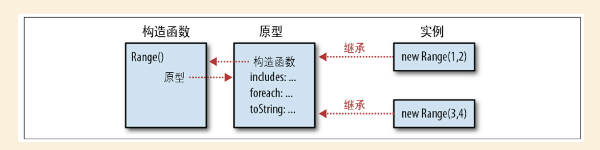

# JavaScript权威指南-第6版


## 第9章 类和模块

### 9.1 类和原型

第6章的inherit()函数通过继承自传入的对象，返回一个新创建的对象，定义了一个JavaScript类，通常该类是实例还需要进一步的初始化，通常是通过定义一个函数来创建并初始化这个对象：


```
function  range(from,  to) {
  var r =  inherit(range.methods);
  r.from =  from;
  r.to =  to;
  return  r;
}
range.methods = {
  includes:  function  (x) {
    return  this.from  <= x  && x  <=  this.to;  
  },
  foreach:  function  (f) {
    for  (var x =  Math.ceil(this.from); x  <=  this.to;  x++)  f(x);
  },
  toString:  function  ()  {
  	return  "(" +  this.from +  "..." +  this.to +  ")";
  }
 };
```

### 9.2 类和构造函数

相比9.1中的例子，Range()构造函数是通过new关键字调用的，在调用构造函数之前就已经创建了新对象，Range()只不过是初始this而已，甚至不必返回新创建的对象。

```

function Range( from, to) {
	this. from = from; 
	this. to = to; 
}
Range.prototype = {
	includes: function (x) { 
		return this. from <= x && x <= this. to; 
	}, 
	foreach: function (f) { 
		for (var x = Math. ceil( this. from); x <= this. to; x++) f( x); 
	},
	toString: function () {
		return "(" + this. from + "..." + this. to + ")";
	} 
};
```

#### a. 构造函数和类的标志

原型对象是类的唯一标志，初始化对象的构造函数则不能作为类的标志，因为两个不同个构造函数的prototype属性可能指向同一个原型对象。但因为构造函数的”外在表现“，它的名字常被用作类名。


```
r instanceOf Range // 如果r继承自Range.prototype，则返回true
```

跟直观的理解不同，我们会以为如上只要r是通过Range构造函数构造出来的，就会返回true，实际上检验的是r是否继承自Range.prototype，不过 instanceOf运算符强化了 ”构造函数是类的共有标志“ 的概念。

#### b. constructor属性

```
var F = function(){}
var p = F.prototype;
var c = p.constructor;
c === F
```

可以看到函数的prototype上可以直接拿到构造函数，于是构造函数是类的”公共标志“，因此这个构造函数为对象提供了类：

```
var o = new F();
o.constructor ==== F;
```

如下图示能基本概括构造函数 和 和原型对象之间的关系，包括原型对象对构造函数的反向引用以及构造函数创建的实例。



在9.2的例子中，我们看到Range的整个prototype对象被重写了，因此新的实例中是不含有constructor属性的的，我们可以有两种办法修正它：

- 在prototype的覆盖对象中指定 `constructor: Range`
- 通过 `Range.prototype.includes = function(){...}` 来给原型对象添加方法

### 9.6 