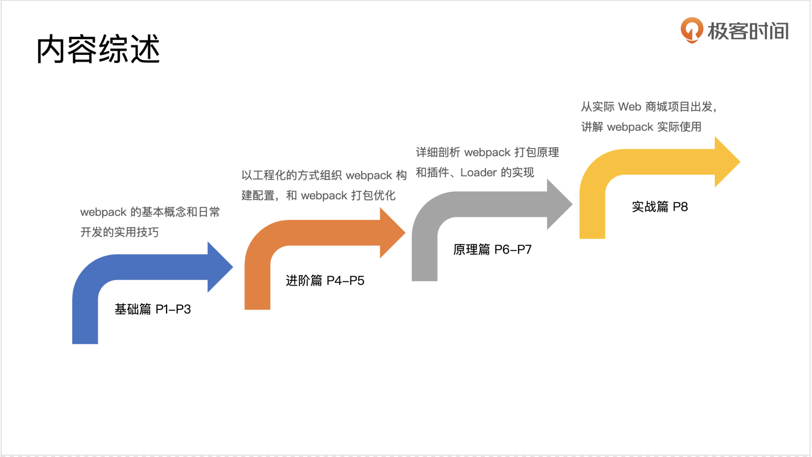
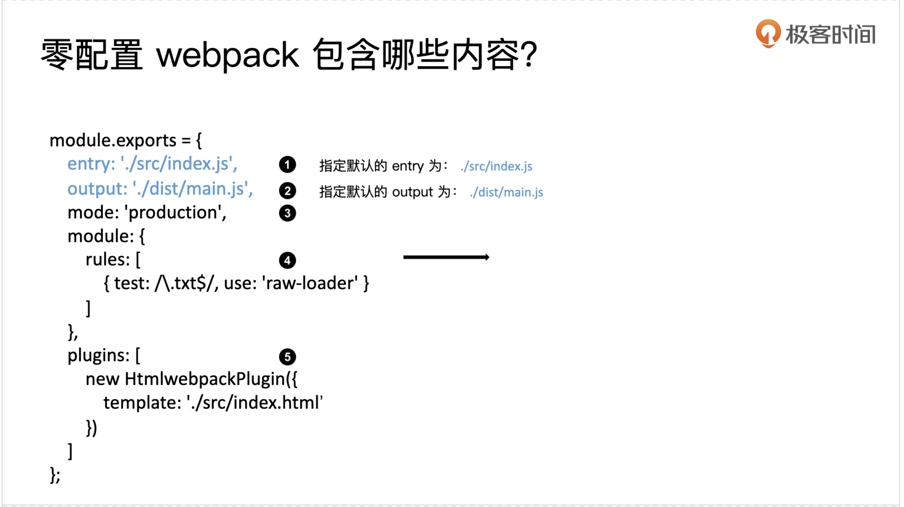
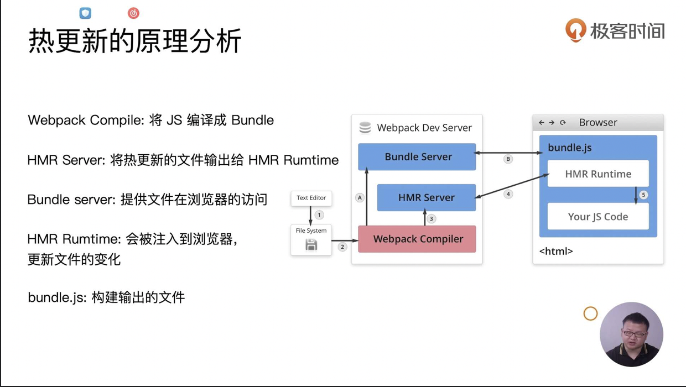

#《玩转webpack》 


## 第一章 构建发展历史和wepack的helloworld


### 1.1 为什么要使用构建工具

- 转换ES6语法
- 转化JSX
- CSS前缀补全、预处理器
- 压缩混淆
- 图片压缩

### 1.2 为什么选择Webpack

- 社区生态丰富
- 配置灵活和插件扩展
- 官方迭代速度快


### 1.3 课程介绍



### 1.4 基础入门




- 命令是在 node_modules/.bin下面去找执行文件的
- webpack的默认执行文件是 webpack.config.js

## 第二章 基础用法

### 2.1

thread-loader以多进程的形式打包css和js

### 2.2

url-loader也可以用来加载图片

### 2.3




### 2.4  

有三种形式：hash，chunckhash, contenthash

1. js文件常用chunckhash
2. css常用contenthash
3. 图片字体等常用hash

### 2.5 压缩

1. webpack4中内置了 uglifyjs 进行了js的压缩
2. css要使用plugin进行压缩 **optimaze-css-assets-webpack-plugin**、cssnao
3. html 文件使用 html-webpack-plugin 在 minify中指定参数进行压缩，source/target的html文件需要指定不同位置

## 第三章 进阶用法

### 3.1 清理构建目录

rm命令、使用 clean-webpack-plugin

### 3.2 CSS功能的增强

PostCSS插件自动补全css前缀（postcss-loader)

### 3.3 适合移动端和Pad的CSS自动转化为rem工具

px2rem-loader、lib-flexible（就是在HTML上设置一个font-size然后通过px2rem-loader来将px转化为rem，很傻瓜式地）

### 3.4 资源内联到HTML中


* 代码层面的好处 ：初始化脚本、上报相关打点、CSS内敛避免页面闪动
* 请求层面的好处：减少HTTP请求的数量（小图片或字体内联）
* HTML和JS内敛：raw-loader
* CSS内联
  * style-loader 使用属性可以将所有style打在一起
  * **html-inline-css-webpack-plugin**（将打包好的css插入到对应位置）

### 3.5 多页面应用打包通用方案

多页面通常需要配置多个entry/htmlwebpackplugin，作者介绍了**Glob**工具可以读取到某个规则的文件比如 `src/*/index.js`，然后通过书写js代码来准备entry/htmlwebpackplugin，个人感觉意义不大，因为项目不会频繁增减入口。
   
   
### 3.8 Tree Shaking

### 3.6 sourcemap

在webpack中可以有多重配置来使用sourcemap，除了问题默认是定位到打包过后的代码不好调试，其他一些可用参数可以让自己以更细的粒度进行代码调试。

### 3.7 提取页面公共资源资源

可以使用webpack-externals-plugin和splitChunks来进行公共资源提取。
将没有用到到代码删除掉，从而对应代码不会打包到bundle.js，要注意的是引入的语法必须是ES6的语法，CJS的require方式是不支持Tree Shaking的。

DCE(dead code elimination)

- 代码不可到达
- 执行结果不会被用到
- 代码只影响死变量（最后没有用到被影响到的变量）

Tree Shaking主要利用的是ES6的特点进行静态分析。

## 3.9 Scope Hoisting

能减少打包的包裹代码从而提高性能，必须是ES6语法，CJS不支持。

在Webpack3中可以加入ModuleConcatenationPlugin插件，在Webpack4中使用`mode:'production'`就已经应用了Scope Hoisting。

```
module.exports = {  
  plugins: [
    new webpack.optimize.ModuleConcatenationPlugin()
  ]
};
```

## 3.10 代码分割和动态导入

适用场景：包括把通用内容抽到共享块；脚本懒加载使用时候再加载。

ES6：动态import，在if/else逻辑里面用的时候再引入。目前没有原生支持，需要Babel转化。

具体使用是要安装 plugin-syntax-dynamic-import 插件，并且配置 .babelrc 文件。

## 3.11 使用ESLint

不同的公司有不同的eslint规范，具体落地又分为：跟CI/CD集成 和 跟Webpack集成。

介绍了跟Webpack集成，主要是通过 `.eslintrc.js` 来实现，里面可以定义parer(比如babel-eslint)，集成自那些已经发布出来的贵方（比如airbnb)，支持的环境（browsser，node），以及需要覆写的规则(rules)。

## 3.12 打包组件和基础库

从一个计算长整数的算法开始，介绍了将代码作为工具输出，输出两个版本的工具，一个普通版本，一个压缩版本

在配置中指定mode为none用于去除默认配置

在optimazation中指定minimize来确定用什么工具压缩什么格式的文件名，这里用了一个可以正常解析es6语法的terserplugin
，它是基于uglify开发出来的

配置中无非也是制定 entry，不同的名字指向到同一个文件， output使用[name].js

为了让用户可以根据环境，自动确定使用什么版本。用了一个index.js作为导出文件，会自动决定加载哪个版本，原理即使用process.env来判定执行的环境

最后介绍了如何将定义的js工具publish到npm中，从而可以被项目引用。

## 第四章 编写可维护的Webpack构建配置