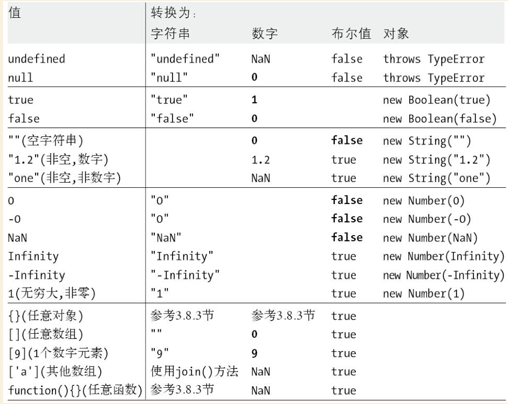

# 第3章 类型、值和变量


**备注：书本讲解的会很细，1-5的表粒度粗细的话，本篇笔记只能算2。**


JavaScript中的数据类型分为

（1）原始类型，包括：数字、字符串、布尔值、null、undefined
（2）对象类型，包括：普通对象、数组、函数、日期、正则、错误


## 数字

JavaScript不区分整数值和浮点数值。

整型直接量，可以使用`0x`或`0X`表示十六进制直接量；某些JavaScript实现支持八进制直接量但在ES6的严格模式下是禁止的，因此最好不要使用。

浮点型直接量，可以使用指数记法，即数字后面跟字母e或E，后面再跟正负号，在加一个整型的指数，比如 `6.02e23`，`1.47E-32`。

Math对象的属性定义了更复杂的算术运算会用到的函数和常量。

JavaScript预定义了Infinity和NaN这两个全局变量，表示正无穷大和非数字值，ES3中这两个值可读可写的错误在ES5中被修正成只可读。

溢出（overflow），当数字运算结果超出了JavaScript所能表示的范围，值分别用Infinity 和 -Infinity表示。

下溢（underflow），运算结果无限接近于零并且比JavaScript所能表示的最小值还小，这种情况下回返回 `0` 或 `-0`。

被零整除在JavaScript并不报错，它只简单地返回Infinity 或 -Infinity 的值。例外情况是，零除以零是没意义的，得到的是一个非数字用NaN表示。

```
1/0 // Infinity
-1/0 //-Infinity
0/0 //NaN
```

在ES3中的Number中定义的属性也是只读的，有 `Math.POSITIVE_INFINITY`，`Math.NEGATIVE_INFINITY`，`Math.MAX_VALUE`，`Math.MIN_VALUE`。

JavaScript中的非数字类型有一个特殊的地方，它和任何值（包括自己）都不相等。需要使用`isNaN()`和`isFinite()`来判定。零和负零是可以用===判定为true的，除了两个值作为除数会有差异以外，几乎是一模一样的。

JavaScript采用的浮点数表示法是一种二进制表示法，可以精确的表示分数（比如1/2，1/8），但我们常用的分数是十进制，二进制浮点数表示法并不能精确表示0.1这样简单的数字，因此就会出现：0.3-0.2==0.1 为 false 的情况。

## 文本

JavaScript中的字符串是使用十六进制表示的Unicode字符集，常用的Unicode字符是通过16位的内码（2个字节）表示，也有不能用16位表示的字符则要用两个16位值组成的序列表示，这意味着一个长度为2的字符串可能只表示一个字符。JavaScript定义的各种字符串的操作方法也都是作用域16位的值，而非字符。

如果只是想换一行进行书写可以直接使用 `\`，如果想要字符内容也换行可以使用`\n`。


## 布尔值

任意JavaScript的值得都可以转换为布尔值，下面这些值会被转换为false：
- undefined
- null
- 0
- -0
- NaN
- ''


## null和undefined


null类型只有null一个成员，它是JavaScript语言的关键字，表示特殊值，用来描述"空值"，对null执行typeof运算，返回字符串"object"，因此可以将它看成一个表”非对象“的对象值。

undefined用于表示更深层的未定义的”空值“，它是预定义的全局变量，它的值就是”未定义“，ES5中修正了ES3中undefined可读/可写的为只读，使用typeof运算符运算返回"undefined"。


## 全局对象

全局对象的属性是全局定义的符号，JavaScript程序可以直接使用，当JavaScript解释器启动或Web浏览器加载新页面时，它将创建一个新的全局对象，并给它一组定义的初始属性：

- 全局属性，undefiend，Infinity，Nan
- 全局函数，比如 isNaN(), parseInt()
- 构造函数，比如 Date(), String()
- 全局对象，比如 Math和JSON

在代码顶部可以用this来引用全局对象，在客户端JavaScript中，Window对象充当了全局对
象，它包含了核心全局属性 + 针对浏览器定义的其他全局属性。


## 包装对象

== 将原始值和包装对象视为相等，===视它们为不等，通过typeof运算符可以看到它们的不同。


## 不可变的原始值和可变的对象引用


原始值是不可更改的，任何方法都无法更改一个原始值；对象被称为引用类型，仅当它们引用同一对象时才相等。

## 类型转换

下标简要说明了JavaScript中如何进行类型转换

;

原始值->原始值，原始值->对象 都比较好理解，但注意一点，当JavaScript期望一个类型的时候，转换会发生（比如`+`和`*`），但一个值转换为另一个值并不意味着两个值相等，在期望使用布尔值的地方使用了undefined，它将会转换为false，但不表明 undefined == false。在某些场合下为了代码清晰易读，我们会进行显示转化，在不使用new运算符的时候，Boolean()、Number()、String()、Object()会作为转换函数做类型转换。

一些特殊的用法：

Number.toString()方法可以接受转换的基数，如果不指定则默认使用十进制。
Number()转换函数传入的字符串，只能是基于十进制进行转换。
parseInt（）和parseFloat()则更加灵活，如果字符串前缀是`0x`或`0X`，pareInt()会将其解释为十六进制数，parseInt()和parseFloat()都会任意数量的前置空格，并且忽略数值后面的内容，如果第一个非空格字符是非法的数字直接量，最终将返回NaN。

```
parseInt(" 3 blind mice") // => 3 
parseFloat(" 3. 14 meters") // => 3. 14 
parseInt("- 12. 34") // => -12 
parseInt(" 0xFF") // => 255 
parseInt(" 0xff") // => 255 
parseInt("- 0XFF") // => -255 
parseFloat(". 1") // => 0. 1 
parseInt(" 0. 1") // => 0 
parseInt(". 1") // => NaN: 整数 不 能以"." 开始 
parseFloat("$ 72. 47"); // => NaN: 数字 不 能以"$" 开始
parseInt(" 11", 2); // => 3 (1* 2 + 1) 
parseInt(" ff", 16); // => 255 (15* 16 + 15) 
parseInt(" zz", 36); // => 1295 (35* 36 + 35) 
parseInt(" 077", 8); // => 63 (7* 8 + 7) 
parseInt(" 077", 10); // => 77 (7* 10 + 7)
```


### 对象转换为原始值

对象转换为布尔值非常简单，所有对象都转换为true，包括Boolean(false)。
对象到字符串 和 对象到数字的转换，是通过调用带转换对象的方法来完成的，下面将要介绍转换规则，注意：这个规则仅适用于本地对象，宿主对象可能有自己的算法。


所有的对象都继承了两个转换方法，第一个是toString()，它的作用是返回一个反应这个对象的字符串：

```
({x: 1, y: 2}). toString() // => "[object Object]"
[1, 2, 3]. toString() // => "1, 2, 3" 
(function( x) { f( x); }).toString() // => "function( x) {\n f( x);\ n}" 
/\d+/ g. toString() // => "/\\d+/ g" 
new Date( 2010, 0, 1). toString() // => "Fri Jan 01 2010 00: 00: 00 GMT- 0800 (PST)"
```

另一个方法是valueOf()，如果存在任意原始值则将对象转换为表示它的原始值，如果对象是复合值无法真正表示表示为原始值，则简单地返回对象本身。日期类定义的valueOf()方法会返回它的一个内部表示，1970年1月1日来的毫秒数。

- 对象到字符串的转换
	- toString()方法
		- 结果是字符串，返回
		- 结果是非字符串原始值，转化为字符串返回
		- 如果没有toString()方法 或者 返回的不是原始值，则进入valueOf的逻辑
	- valueOf()方法
		- 存在这个方法，并且返回的是原始值，则转化为字符串返回
		- 没有这个方法，或者返回的不是原始值，进入类型错误
	- 类型错误

所能预想到的对象类型，转换结果几乎都是toString()结果的返回。


- 对象到数字的转换
	- 	对象有valueOf()方法，并且返回原始值，则转化为数值返回
	- 如果有toString()方法，并且返回原始值，则转化为数值返回
	- 类型错误


空数组和有单个内容的数组，转化为数字的过程可以理解为：


[] => valueOf [] => toString() '' => 0
[1] => valueOf [1] => toString '1' => 1


`+`运算符和`==`运算符，如果其中一个操作数是对象，则JavaScript将对象转化为原始值，原始值目标类型通常都是数字，因此首先调用valueOf，但这里的转换和上述的转换差别在于，返回的原始值将被直接使用，而不会强制被转化为数字或字符串。

疑问：此处说的转化，跟上述的有什么不同？不都是通过 `+` 和 `==` 来触发？
	

## 变量声明

略

## 变量作用域

有些编程语言有块级作用域的概念，即花括号内的代码都具有各自的作用域，变量在声明它们的花括号之外是不可见的。

而JavaScript中没有块级作用域，只有函数作用域，即变量在声明它们的函数体以及这个函数体嵌套的任意函数内都是有定义的。变量在声明之前已经可以使用，这个特性被称为声明提前。

全局对象上的属性定义有一些需要注意的地方：

```
var truevar = 1; // 声明 一个 不可 删除 的 全局 变量 
fakevar = 2; // 创建 全局 对象 的 一个 可 删除 的 属性 
this.fakevar2 = 3; // 同上 
delete truevar // => false: 变量 并没有 被 删除 
delete fakevar // => true: 变量 被 删除 
delete this.fakevar2 // => true: 变量 被 删除
```

## 作用域链 

略


