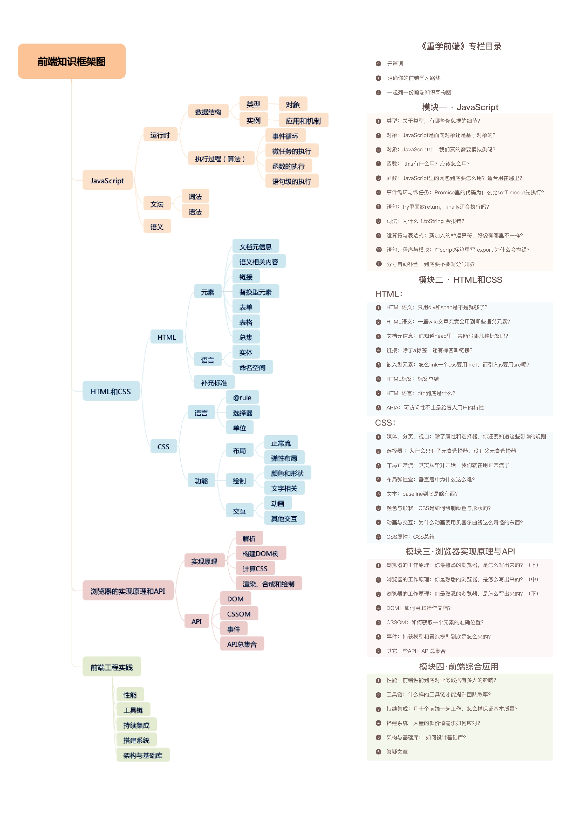
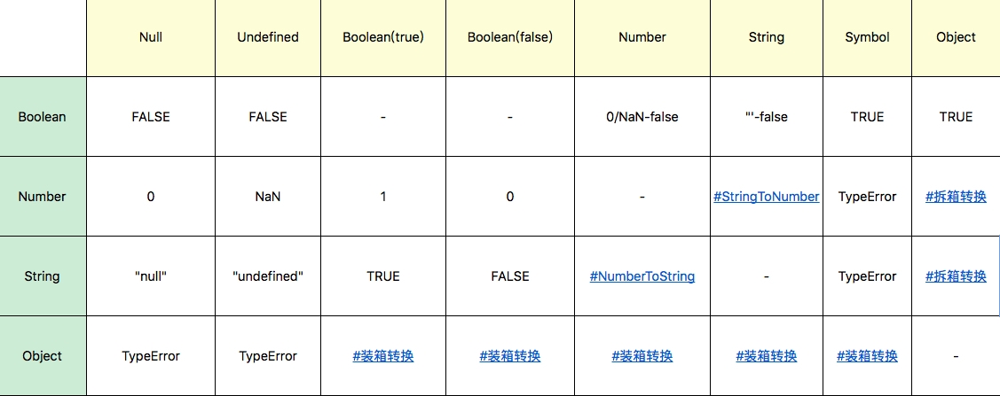
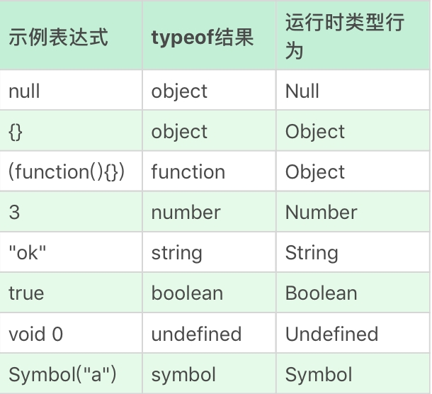

# 重学前端


## 第一节

工程师的价值体现在：他的知识体系，能从工程角度思考前端存在的价值。

## 第二节 

学习前端的方法有两个：构筑知识体系，追本疏远。

## 第三节 列举前端知识框架

### 课程目标

不是参考手册，也不是语言标准，本课程是为了：

- （1）无法查阅解决的原理和背景解释清楚。
- （2）将不便于查阅和记忆的内容整理好。

### 课程内容

- （1）JavaScript语言
- （2）HTML CSS
- （3）浏览器和实现原理和API
- （4）实践中遇到的问题和解决方案




### 讲解方法

也分为两种，一种会重点讲解一些内容，另外会按照图谱的形式给到你查阅的列表。

## 第四节 HTML语义 

直接使用div+span的方法好不好呢？作者主张区别看待。

在“软件界面”的场景下，元素多数是没有语义的，比如购物车列表不一定要套上ul，加入购物车这个列表不一定要使用button，作者建议直接在“软件界面”的场景中使用div+span即可。

但在另外一些场景下，使用语义化标签有它的好处：

- 对开发者友好可读性更强，更便于开发和维护
- 适合机器阅读，适合搜索引擎搜索，支持读屏软件，根据文章可以自动生成目录等。


因此作者的态度是
> **“用对”比“不用”好，“不用”比“用错”好。有理想的前端工程师应该追求“用对”它们。**

可能用“不对”的主要原因是在不适合使用该语义标签的地方使用，结果给机器造成混淆、增加嵌套，给CSS的编写者增加负担。


作者介绍了使用语义化标签的重要场景：

（1）作为自然语言延伸的语义类标签，来表达一定的结构或消除歧义。

（2）作为标题摘要的语义类标签。

（3）作为整体结构的语义类标签。

作者围绕Wiki的一个页面大概介绍了什么样的位置要使用什么语义化标签。


自己总结的一些缺点：有些标签的标准在变化，未必能按照正确的用法来使用它，实际使用过程中还会需要一些配套的标签因此会在取名上很费劲，低版本的浏览器兼容性未必好需要使用css shim来兼容。

## 第五节 JavaScript的类型

本节重点补充一些遗漏的知识，本篇从**运行时**角度来看待JavaScript的类型系统。

7种语言类型：Undefined, Null, Boolean, String, Number, Symbol, Object。

### Undefined


**为什么用void 0代替undefined？**

void是一个一元运算符，放在任意操作数前，操作数会照常计算，但是忽略运算结果并返回undefined。

Undefined类型表示未定义，该类型只有一个值那就是undefined，一般我们可以用全局变量undefined来表示这个值。因为undefined是一个变量而非关键字， 为了避免被无意篡改（在ES3中是可读可写的，在ES5中被修正了），我们建议使用void 0来获取undefined的值。


### Null

Null类型也只有一个值，那就是null，它的语义表示为空值。和undefined不同，null是JavaScript关键之，因此可以在任何代码中用关键字null来获取null值。

### Boolean

Boolean有true和false两个值。

### String

**字符串是否有最大长度？**

字符串的最大长度为 2的53次方减1，这个长度不是字符串长度，而是使用16进制表示后的长度。

注：这里涉及到字符串的编码知识，简单概括下 Unicode 是一种比较全的字符和码的映射关系，它的存储方式又有utf-8和utf-16等，前者可能使用1-4字节存储字符，后者使用2字节来存储字符。


字符串是无法变更的，一旦字符串构造出来，无法用任何手段改变字符串的内容。

0-65536（U+0000 - U+FFFF）的码点被称为基本字符区域（BMP），JavaScript字符串把每个UTF16单元单做一个字符来处理，所以处理非BMP范围的字符时候，应该格外小心。这个设计继承自Java，设计的目标是”性能和尽可能实现起来简单“，因为现实中很少用到BMP外的字符。

### Number


JavaScript的Number类型符合IEEE 754-2008规定的**双精度浮点数规则**，有效的整数范围是 -0xffffffffffffffff至+0xffffffffffffffff，而无法表示此范围以外的数字。

根据浮点数的定义，非整数的Number类型无法用`==`和`===`进行比较，即`0.1+0.2==0.3`会得到`false`的结果。要比较它应该使用JavaScript提供的最小精度值，`0.1+0.2-0.3<= Number.EPSILON`。

为了表达几个额外的语言场景，JavaScript引入了几个例外情况：

- NaN，占用了某个符合IEEE规则的数值
- Infinity，无穷大
- -Infinity，负无穷大

另外在JavaScript中有`+0`和`-0`的区别，在加法运算中没有什么区别，但是在除法场合中需要区分，区分它们的方式是 `1/x` 看是得到 `Infinity` 还是 `-Infinity`。


### Symbol

创建Symbol的方式是 `var s = Symbol("my symbol")`，及时字符串内容一样创建的两个实例也是不相等的。

### Object

JavaScript中的几个基本类型，在对象类型中都有对应：
- Number
- String
- Boolean
- Symbol

3和new Number(3)完全不同的值，一个是Number类型，一个是对象类型。

**为什么对象的方法能用在基本的类型上？**

```
var num = 3; 
num.toString();

```
JavaScript在语言设计上试图模糊对象和基本类型之间的关系，甚至我们在类的原型上添加的方法，可以被基本类型所调用。具体做法就是`.`运算符提供了装箱操作，它会根据基础类型构造一个临时对象，使得我们能在基础类型上调用对应对象的方法。

### 类型转换

类型转换很多是符合直觉的，但也有一些几乎不可能记得住的部分，比如 `==` 的用法，因此很多实践要求禁止使用 `==`，而是显式地进行类型转换以后，用 `===` 进行比较。



转换中比较复杂的部分有：

- StringToNumber，类型转换支持十进制、二进制、八进制和十六进制，此外还包括正负号科学计数法，注意的是parseInt和parseFloat并不适用这个转换，Number是比它们要更好的选择。
- NumberToString，在较小范围内，数字到字符串的转换是完全符合直觉的十进制表示，当Number的绝对值较大或较小时，字符串是使用科学计数法表示的。
- 装箱转换
- 拆箱转换

【备注】：该部分涉及到 typeof instanceof prototype.constructor Symbol 等的不太熟悉的知识点，他们用来结合提到的转化过程，需要单独研究！

另外 typeof 的运算结果，跟运行时的规定，有很多不一致的地方，设计者也认为typeof的设计是有缺陷的，但已经错误了修正时机：



## 第五节 面向对象还是基于对象


该部分比较偏重理论，无太多值记录的部分。

在使用层面需要知道对象属性，可以按照属性值是 数值 还是setter/getter来区分。

并且可以用 `Object.getOwnPropertyDescriptor` 来获取到属性的特性描述即可。

在 《JavaScript权威指南》第六章，开篇部分 + 6.6节 有足够清楚的说明。

## 第六节 我们真的需要模拟类吗

讲解了JavaScript中使用`类`的传统做法/原理和ES6中的使用。


