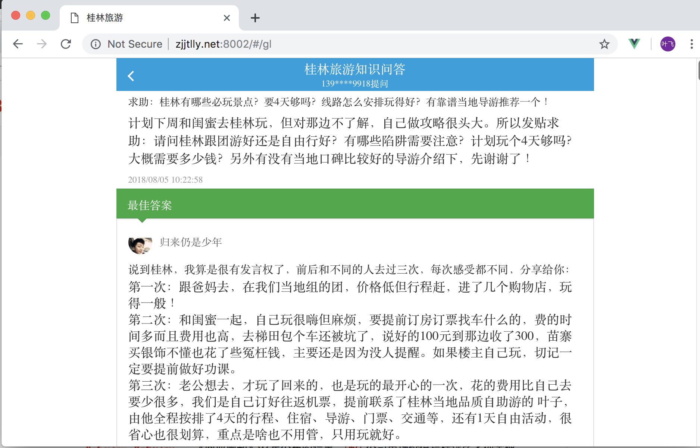

## 1. common phenomenon

### 1.1 margin collapse

桂林也为例，.summary {margin: 3px 16px;} .summary p {margin: 1em; font-size: 14px;} 

父子margin重合了在视觉上是之有父容器的margin，但是实际的空间却是子的margin的，并且是吞没关系

TODO 进一步研究margin的应用场景


## 2. page layout

### 1.1 horizontal center same margin besieds

#### a. effect



#### b. snippet

```
margin: 0-auto; 
max-width: 640px; 
min-width:320px;
```

## 3. attributes

### 3.1 display

- what's difference between `inline` and `inline-block` 


	Elements with display:inline-block are like display:inline elements, but they can have a width and a height. That means that you can use an inline-block element as a block while flowing it within text or other elements.


	Difference of supported styles as summary:

	- inline: only margin-left, margin-right, padding-left, padding-right
	- inline-block: margin, padding, height, width


- what' does `-webkit-box` used for and how to explain blow codes: 


	```
 .guilin-page .pnl_userInfo .user_info {
	float: left;
	-webkit-box-sizing: border-box;
	display: -webkit-box;
	-webkit-box-align: center;
	-webkit-box-pack: start;
  	box-sizing: border-box;
}  
```


	[something-about-display-webkit-box-webkit-box-flex1](https://stackoverflow.com/questions/6673555/something-about-display-webkit-box-webkit-box-flex1)


- `position: absolute` would make `inline` element's width/height configurable?

	For `block` type `position: absolute` would make it's default `width` lost, you need to set it seperately. Same to `inline` it would break origin flow, and the `width` and `height` can be configured.


### 3.2 line-height


`line-height: 1;` 代表跟字体大小同等的高度


### 3.3 float

### 3.4 font-size

`em` vs `%` vs `rem`, relatinship with `line-height`


### 3.5 box-size

设置了width和height以后

- 默认是包含padding在内的
- box-size: border-box是连同padding+border在内
- box-size: content-box是只包含内容区域，不包含padding的

