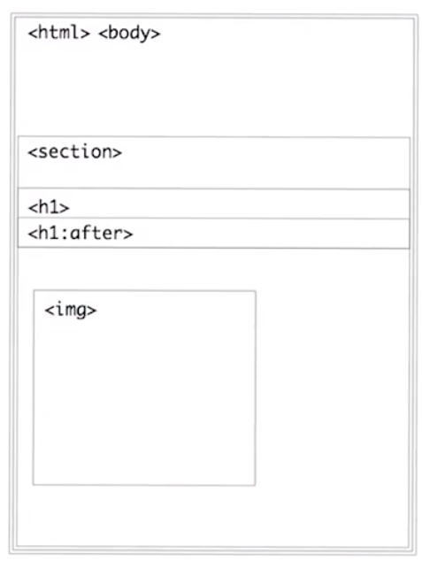
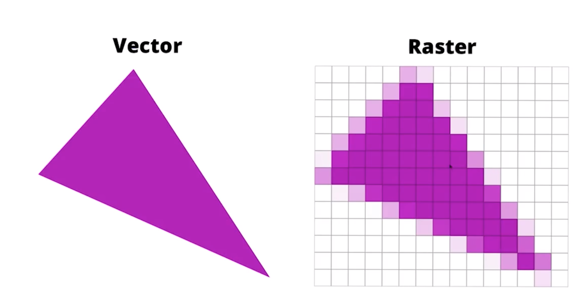
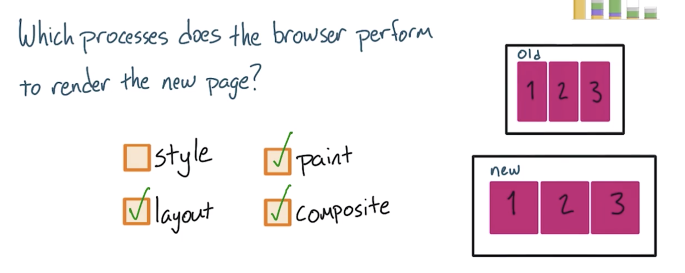
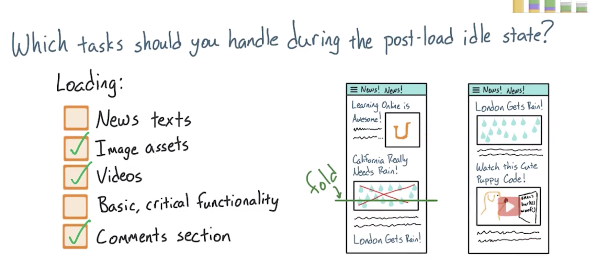
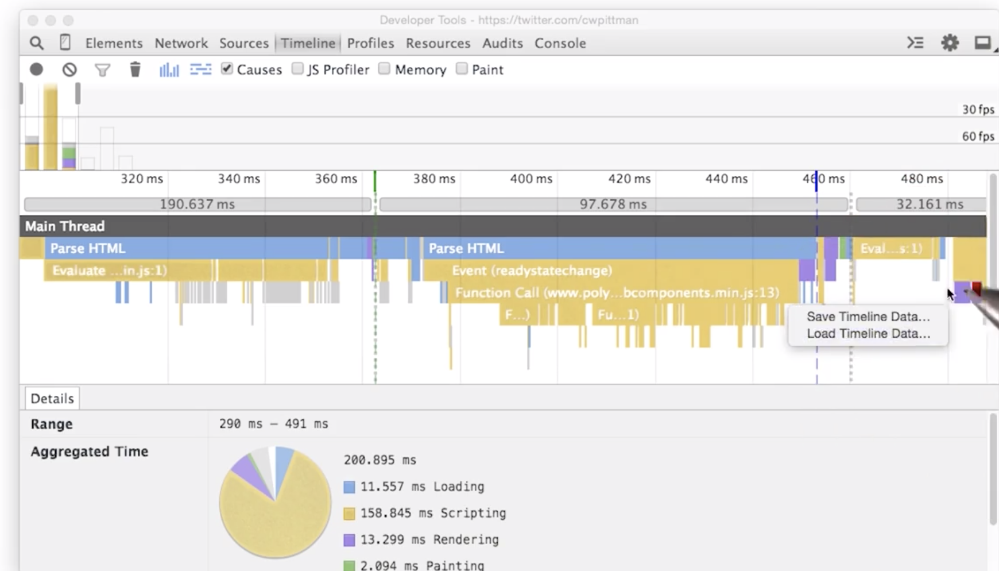

# 浏览器渲染优化

[浏览器渲染优化](https://classroom.udacity.com/courses/ud860)

## 第1课 关键渲染路径

大多数设备刷新屏幕的频率是60帧/秒，称为60HZ（fps, frame per second），因此我们需要展示60帧。

用户能很敏锐的觉察到我们是否有丢失帧数，浏览器花费太长时间才能展示某一帧，它就会丢失它，严重的情况是，它会变的卡顿。

**网页内容被填充到屏幕的简单流程**

当DOM和CSSOM构建好，浏览器知道每个元素会应用什么样式规则以后，它会开始计算布局，在浏览器调试工具中可以看到它被定义为`Layout `。

一个元素的布局，比如body的width属性，会影响到所有的子元素，所以这一过程对于浏览器而言会非常复杂。有时候你也会听到这一过程被称作`reflow`。

流程的下一步是vector到raster，即我们需要把下图左边的方框，填充像素成为右边这样，这就是rasterizer所做的事情。通常这一部分的工作叫`paint`。

在示例中还可能看到`draw bitmap`的调用，过程是通过网络发送请求获取到PNGs，然后将内容解压，然后进行大小的自适应。

上述的介绍都只是在一个层（Surface）上进行的，有时候我们可能创建多个层，称为Layers或Compositor layers，他们能够被单独进行绘制。不同的Layer进行单独绘制，处理Layer显示的过程被成为 `composite layers`，课程将会介绍Layer的内容来确保你不会创建多余的Layer。

网页的绘制其实是想下面的网格的区块，它们通常不是开发人员所能控制的，通常CPU会将每个网格的片上传给GPU（以composite layer的形式），GPU在进行绘制到显示设备上。

**这里插入渲染的三种路径**

如上的练习中，一个flex的容器当浏览器被resize到更大的宽度的时候，子元素也会变大，几种行为中有哪些会发生呢？style没有发生改变，而layout、paint和composite都需要被触发。

**渲染的过程**

渲染的过程举例：JavaScript > Style  > Layout > Paint > Composite

有三种渠道可以到值整个过程进行运作：

注：通常界面变化的由JavaScript发起（当然不是必须，诸如动画之类也可以导致界面变化）

第1种（各种操作对应上述箭头流程的各个阶段）

- 通过CSS或者JavaScript导致了视觉上的变化
- 浏览器recalculate计算收到影响的元素的样式
- 如果你修改了Layout，即修改了元素的geometry（比如宽度、高度、位置），那么浏览器需要检查所有其他元素，并且进行对网页进行reflow
- 受到影响的区域会被repainted
- 最终绘制的元素会被composited到一起

第2种
- 仅修改了用于paint的属性，比如背景图、文字颜色、阴影
- 同样，浏览器recalculate
- 不需要进行layout操作，因为没有修改geometry相关的属性
- 同样，进行paint
- 同样，进行composite

第3种
- 修改了stlye，单既没有涉及到layout也没有设计到paint，
- 只需要进行composite操作即可

总结上述三种情况，都会涉及到Style的修改，因此会触发后续的Layout还是Paint决定了我们的网页的性能。

## 第2课 App生命周期

Rail

- Response 100ms 用户要在1/10秒对操作感知到想用响应
- Animation 16ms(10-12ms）
- Idle 50ms 留给Idle用于处理其他任务的时间
- Load 1second 1秒内需要加载好初步内容呈现给用户

通常要求在1s内将所有请求加载好（Response），然后在Idle阶段准备一些为了达成1s加载而没有完成的工作。

在一个示例的新闻网站App中，如下哪些是应该在 加载好之后的闲置时间被处理的任务：

第新闻文案、基本功能项目作为基本功能，是必须最优先被处理好的，而图片、视频、评论可以在这个阶段处理。

尽管如此，用户仍可能很快就进行基础功能的使用，因此用于处理这几个任务的时间会非常短，可能只有50ms。

## 第三课 卡顿杀伤性武器

通过使用Chrome Devtools的分析工具，我们可以分析JavaScript代码的执行时间，如下是两个录制好的分析数据：

[timeline-l3-reading-the-timeline](https://www.udacity.com/api/nodes/4156258563/supplemental_media/timeline-l3-reading-the-timeline/download)

[timeline-l3-reading-timeline](https://www.udacity.com/api/nodes/4158208827/supplemental_media/timeline-l3-reading-timeline/download)

可以看到在每一段黄色区域执行的时间耗费了大约70ms，距离16ms时间（1000ms/60fps)还有一定距离，因此是无法流畅地响应地。

可以利用这个技术来侦测自己的项目中，明显感觉到卡顿的地方（比如TSP的菜单展开）。

如果你在针对移动设备开发，当然需要在移动设备上进行相当的测试，本章提供了关于如何在安卓和IOS设备上开发的一些指引，需要的时候可以参考。

