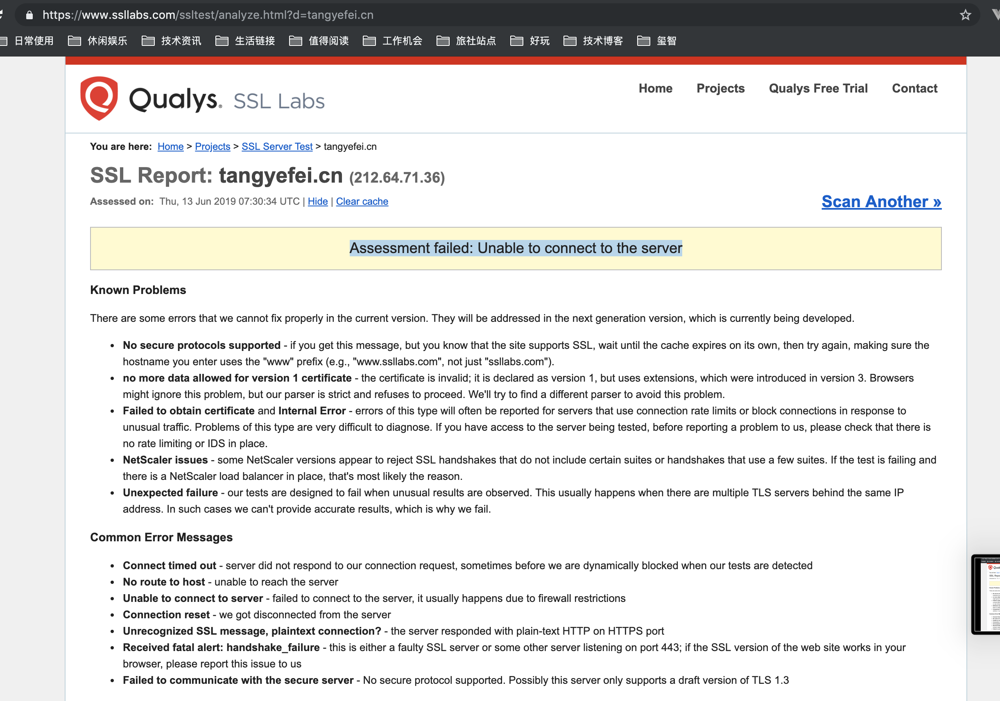
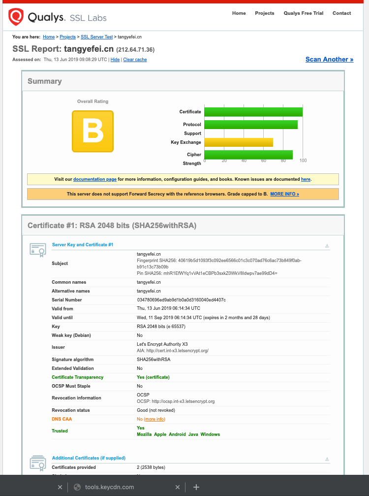

# 围绕HTTP、HTTPS、HTTP/2的进行的实践

这块涉及的知识点发现比想象的多很多，慢慢把学习到的知识点，完善到这篇博客中：

|更新时间|内容|
|---|---|
|2019年6月13日|HTTPS的作用|
|2019年6月14日|在博客使用HTTPS|


## 1. HTTPS的作用


[阮一峰：SSL/TLS协议运行机制的概述](http://www.ruanyifeng.com/blog/2014/02/ssl_tls.html)：

（1） 所有信息都是**加密传播**，第三方无法窃听。

（2） 具有**校验机制**，一旦被篡改，通信双方会立刻发现。

（3） 配备身份证书，**防止身份被冒充**。


[StackOverflow: 谁能窃听HTTP请求中的数据](https://serverfault.com/questions/19360/who-can-eavesdrop-on-a-users-http-traffic)

## 2. 在博客使用HTTPS


参考 [阮一峰：HTTPS 升级指南](http://www.ruanyifeng.com/blog/2016/08/migrate-from-http-to-https.html)，使用[Let's Encrypt 提供的工具选择 Linux + Centos7](https://certbot.eff.org/lets-encrypt/centosrhel7-nginx)，只执行如下两个命令即可生成证书：

```
$ sudo yum install certbot python2-certbot-nginx
$ sudo certbot --nginx

IMPORTANT NOTES:
 - Unable to install the certificate
 - Congratulations! Your certificate and chain have been saved at:
   /etc/letsencrypt/live/tangyefei.cn/fullchain.pem
   Your key file has been saved at:
   /etc/letsencrypt/live/tangyefei.cn/privkey.pem
   Your cert will expire on 2019-09-11. To obtain a new or tweaked
   version of this certificate in the future, simply run certbot again
   with the "certonly" option. To non-interactively renew *all* of
   your certificates, run "certbot renew"
 - Your account credentials have been saved in your Certbot
   configuration directory at /etc/letsencrypt. You should make a
   secure backup of this folder now. This configuration directory will
   also contain certificates and private keys obtained by Certbot so
   making regular backups of this folder is ideal.
```

再把pem文件的内容拷贝到 [SSL Certificate Check](https://tools.keycdn.com/ssl)（需翻墙） 校验下格式正确。

阮一峰的提到了 用 [ SSL Labs Server Test ](https://www.ssllabs.com/ssltest/analyze.html) 检查一下证书是否生效，得到的结果如下，怀疑是因为服务器在国内（腾讯云）上，所以无法连接。

```
Assessment failed: Unable to connect to the server
```




索性直接配置nginx再说，不去管它校验，[这篇关于Nginx中配置ssl的文章](https://www.tecmint.com/fix-400-bad-request-in-nginx/) 可能比阮一峰介绍的更详细并且不容易引起误解：

```
server{
        listen 80;
        server_name example.com www.example.com;
        return 301 https://www.example.com$request_uri;
}
server {
        listen 443 ssl http2;
        server_name example.com www.example.com;
        # SSL/TLS configs
        ssl on;
        ssl_certificate /etc/ssl/certs/example_com_cert_chain.crt;
        ssl_certificate_key /etc/ssl/private/example_com.key;
}    
```

总结下来就是：普通的访问会来到80端口，然后重定向到https；https会访问443端口（需要使用云服务器的配置中打开出参规则），并且打配置ssl相关的参数。重启nginx这样一来，通过http和https方式都能访问到个人的站点了。

此外，[腾讯云的证书管理](https://console.cloud.tencent.com/ssl) 中也可以申请免费的证书，可以作为一个选择。


**最后令人觉得奇怪的是：**等到自己能按照 http 和 https 访问个人博客以后，再用 [ SSL Labs Server Test ](https://www.ssllabs.com/ssltest/analyze.html) 进行校验，发现居然通过了（如下图）？怀疑是之前443端口没打开的缘故？然而把在腾讯云上把443的出参规则删除掉了，丝毫不影响https方式的访问，不理解了（待解答）。





