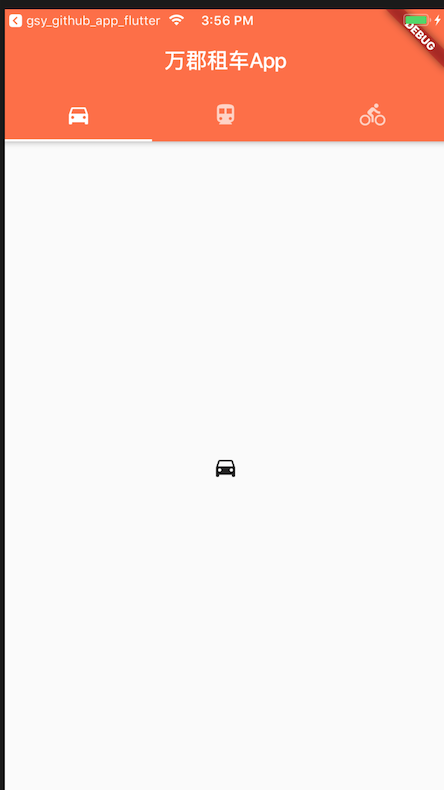

# GSYGithubAppFlutter项目学习

地址：[https://github.com/CarGuo/GSYGithubAppFlutter](https://github.com/CarGuo/GSYGithubAppFlutter)

## commit: aefcb03


自定义包的引入方式为：`import 'package:maxima_cars/widget/Tsp.dart';`

<hr>

使用组件名而非文件名，比如上述文件内定义的组件为 `class TspWidget`，用法 `new TspWidget()`。
<hr>
`final static const`的用法区别：

- static 用于修饰类的成员变量
- final 用于修饰必须初始化好并且不能改变的变量
- const 用啦修饰值，比如 `var point  = const Point(1,2);`

<hr>

`MaterialApp` 和  `Scaffold`的区别

- MaterialApp：代表Material设计风格的应用
- Scaffold：实现了基本的Material布局结构


<hr>

构造函数的若干知识点如下：( 参考自[这里](http://dartdoc.takyam.com/dart-tips/dart-tips-ep-11.html) )

（1）下面两种语法是等价的，第二种语法是第一种的简写：

```
FluffyBunny(String name, num fluffiness) {
    this.name = name;
    this.fluffiness;
}

FluffyBunny(this.name, this.fluffiness);
```

（2）构造函数支持可选参数，如下为它的语法

```
class FluffyBunny {
  String name;
  num fluffiness;

  FluffyBunny(this.name, {this.fluffiness});
}

var floppy = new FluffyBunny('floppy', fluffiness: 0.72);
```

(3) 类会默认调用一个不带参数的构造函数，下例为 `Point() : super();`
  
  
```
class Point {
  num x;
  num y;
}

var point = new Point();
```

(4) 构造函数后面跟 `:` 的语法

`:` 号后面的语法无法访问到this，因此直接使用变量

```
import 'dart:math';

class Point {
  final num x;
  final num y;
  final num distanceFromOrigin;
  
  Point(x, y)
      : x = x,
        y = y,
        distanceFromOrigin = sqrt(pow(x, 2) + pow(y, 2));
}
```

```
class Bunny {
  String name;
  
  Bunny(this.name);
}

class FluffyBunny extends Bunny {
  num fluffiness;
  
  FluffyBunny(String name, this.fluffiness) : super(name);
}
```

（5）StatefulWidget的key

```
GSYTabBarWidget(
      {Key key,
      this.type,
      this.tabItems,
      this.tabViews,
      this.backgroundColor,
      this.indicatorColor,
      this.title})
      : super(key: key);
```
 
可以理解为 Key key 可以自动生成一个标记，将值按照 k:v 的方式传递给了父类。


<hr>

要使用TabBar必须提供TabController，如下是一种做法，使用 DefaultTabController 达成如下图的效果： 




```
@override
Widget build(BuildContext context) {
	return new DefaultTabController(
	  length: this.tabItems.length,
	  child: new Scaffold(
	    appBar: new AppBar(
	      title: new Text(this.title),
	      backgroundColor: this.backgroundColor,
	      bottom: new TabBar(
	        tabs: this.tabItems,
	        indicatorColor: this.indicatorColor
	      )
	    ), 
	    body: new TabBarView(
	      children: this.tabViews
	    )
	  )
	);
}
```

<hr>

另一种做法是使用自定义的TabController，涉及到  Provider、AnimationController、StatefulWidget的概念。具体结构部分如下：

```
    return new Scaffold(
        appBar: new AppBar(
          backgroundColor: _backgroundColor,
          title: new Text(_title),
        ),
        body: 
        new TabBarView(
            //TabBarView呈现内容，因此放到Scaffold的body中
            controller: _tabController, //配置控制器
            children: _tabViews),
        bottomNavigationBar: new Material(
          //为了适配主题风格，包一层Material实现风格套用
          color: Colors.deepOrange, //底部导航栏主题颜色
          child: new TabBar(
            //TabBar导航标签，底部导航放到Scaffold的bottomNavigationBar中
            controller: _tabController, //配置控制器
            tabs: _tabItems,
            indicatorColor: _indicatorColor, //tab标签的下划线颜色
          ),
        ));
  }
```

## commit: 3392f37

设置Timeout来跳转到一个的路由，涉及的概念有：`dart.async`, `Furture`, `delayed`, `Navigator`, `pushReplacement`, `MaterialPageRoute`。


```
import 'package:flutter/material.dart';
import 'dart:async';
import 'package:maxima_cars/page/HomePage.dart';

class WelcomePage extends StatelessWidget {
  @override
  Widget build(BuildContext context) {

    new Future.delayed(const Duration(seconds: 2), () {
      Navigator.of(context).pushReplacement(new MaterialPageRoute(builder: (context) {
        return new HomePage();
      }));
    });
    return new Container(
      color: Colors.white,
      child: new Center(
        child: new Text('李彦宏被泼水', style: new TextStyle(color: Colors.black, fontSize: 22.0))
      )
    );
  }
}
```


