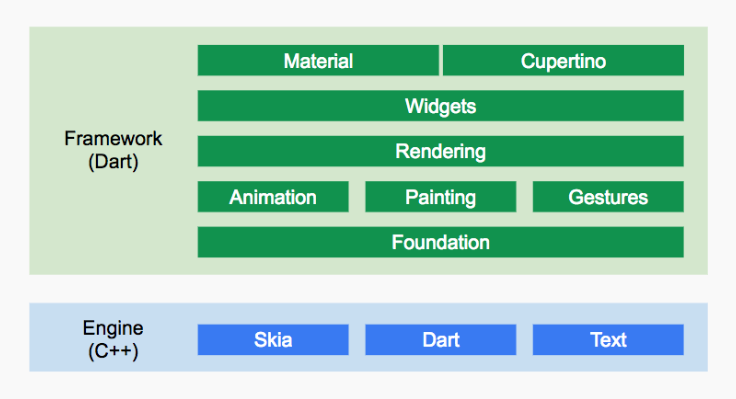

# 《Flutter实战》

# 开篇

作者现字节跳动工程师，开元了Gitme、CookieJar、Dio、Flukit等多个项目。

广告：长期招聘前端、移动端高工，有意者请发简历到duwen32767@163.com 或加微信Demons-du.

# 起步

## 移动开发技术简介

原生开发优势是移动端功能支持度好、速度快；缺点是，开发成本高，动态化弱。

### 跨平台技术简介(Hybrid)

- H5+原生（Cordova、Ionic、微信小程序）
- JavaScript开发+原生渲染 （React Native、Weex、快应用）
- 自绘UI+原生(QT for mobile、Flutter)

### H5+原生

通过原生的网页加载控件WebView (Android)或WKWebView（iOS）来加载需要动态变动的内容，H5部分是可以随时改变而不用发版，动态化需求能满足；同时，由于h5代码只需要一次开发，就能同时在Android和iOS两个平台运行，这也可以减小开发成本。缺点是性能不好，对于复杂用户界面或动画，WebView不堪重任。

我们称这种h5+原生的开发模式为混合开发 ，采用混合模式开发的APP我们称之为混合应用或Hybrid APP ，如果一个应用的大多数功能都是H5实现的话，我们称其为Web APP 。

WebView实质上就是一个浏览器内核，对于大多数系统能力都没有访问权限，如无法访问文件系统、不能使用蓝牙等。而混合框架一般都会在原生代码中预先实现一些访问系统能力的API， 然后暴露给WebView以供JavaScript调用，我们把这种消息传输协议的工具称之为简称 JsBridge。

### JavaScript开发+原生渲染

#### React Native和Weex

React Native是Facebook于2015年4月开源的跨平台移动应用开发框架，和React原理相通，并且Flutter也是受React启发，此处深入了解一下React原理。

React是一个响应式的Web框架，有两个重要的概念：DOM树与响应式编程。

（1）**DOM树与控件树**

DOM树和控件树是等价的概念，只不过前者常用于Web开发中，而后者常用于原生开发中。

（2）**响应式编程**

状态改变则UI随之自动改变，而React框架本身就是响应用户状态改变的事件而执行重新构建用户界面的工作，这就是典型的响应式编程范式。


React Native 和 React的主要的区别在于虚拟DOM映射的对象是什么？React中虚拟DOM最终会映射为浏览器DOM树，而RN中虚拟DOM会通过 JavaScriptCore 映射为原生控件树。

相对于混合应用，由于React Native是原生控件渲染，所以性能会比混合应用中H5好很多，同时React Native是Web开发技术栈，也只需维护一份代码，同样是跨平台框架。


Weex是阿里巴巴于2016年发布的跨平台移动端开发框架，思想及原理和React Native类似

#### 快应用

国内9大主流手机厂商共同制定的轻量级应用标准，原生控件渲染，与React Native和Weex相比主要有两点不同：采用JavaScript语言开发；渲染/排版引擎是集成到ROM中的，应用中无需打包，安装包体积小。

### 自绘UI+原生

####  QT简介

自绘UI+原生通过在不同平台实现一个统一接口的渲染引擎来绘制UI，而不依赖系统原生控件，所以可以做到不同平台UI的一致性。注意，自绘引擎解决的是UI的跨平台问题，如果涉及其它系统能力调用，依然要涉及原生开发。

自绘制引擎的思路并不是什么新概念，Flutter并不是第一个尝试这么做的，在它之前有一个典型的代表，即大名鼎鼎的QT。

因为种种原因，尽管QT是移动端开发跨平台自绘引擎的先驱，但却成为了烈士。

#### Flutter简介

就QT失败的种种原因，我们看看Flutter的现状。基于如下三点，可以看到Flutter未来一篇光明：

- 生态：活跃用户正在高速增长，社区现在已经很庞大，文档、资源也越来越丰富。
- 支持：Google对Flutter的投入的资源不小，所以在官方技术支持这方面，大可不必担心。
- 效率：热重载在模拟器或真机上可以毫秒级热重载，并且不会丢失状态，完胜原生的编译速度。

### 总结


## Flutter简介
 
**跨平台自绘引擎**

Flutter与用于构建移动应用程序的其它大多数框架不同，因为Flutter既不使用WebView，也不使用操作系统的原生控件。 相反，Flutter使用自己的高性能渲染引擎来绘制widget。

**高性能**

Flutter采用Dart语言并支持AOT，加上使用自己的渲染引擎来绘制UI，可以带来可观的性能。


### Flutter框架结构



Widgets层是Flutter提供的的一套基础组件库，在基础组件库之上，Flutter还提供了 Material 和Cupertino两种视觉风格的组件库。而我们Flutter开发的大多数场景，只是和这两层打交道。

Engine 这是一个纯 C++实现的 SDK，其中包括了 Skia引擎、Dart运行时、文字排版引擎等。在代码调用 dart:ui库时，调用最终会走到Engine层，然后实现真正的绘制逻辑。


### 如何学习Flutter

- 资源：官网、源码及注释、Github、Gallery源码（官方提供的示例App 源码的examples目录下）
- 社区：stackoverflow、flutter中文社区、掘金


## 搭建Flutter开发环境


### 连接Android真机设备


- 在Android设备上启用 开发人员选项 和 USB调试(设置-关于本机-系统版本号上连续点击7下）。
- 使用USB将手机插入电脑，授权你的电脑可以访问该设备。
- 在命令行运行 flutter devices 命令以验证Flutter识别您连接的Android设备。
- 运行启动你应用程序 flutter run。


```
Error: ADB exited with exit code 1
Performing Streamed Install

adb: failed to install /Users/yefeitang/Documents/flutter_projects/flutter_widgets/build/app/outputs/apk/app.apk: Failure [INSTALL_FAILED_ABORTED: User rejected permissions]
Error launching application on VTR AL00.

```

运行遇到了如上所示的问题，将 ”监控 ADB 安装应用“ 关闭即可。

## 连接iOS真机设备

略

## 常见配置问题

略

## Dart语言简介


其他略。留个印象（异步支持：Future、Async/await、Stream）。


# 第一个Flutter应用


