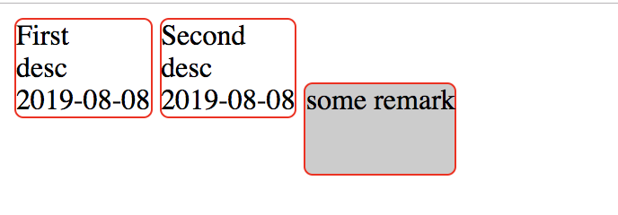
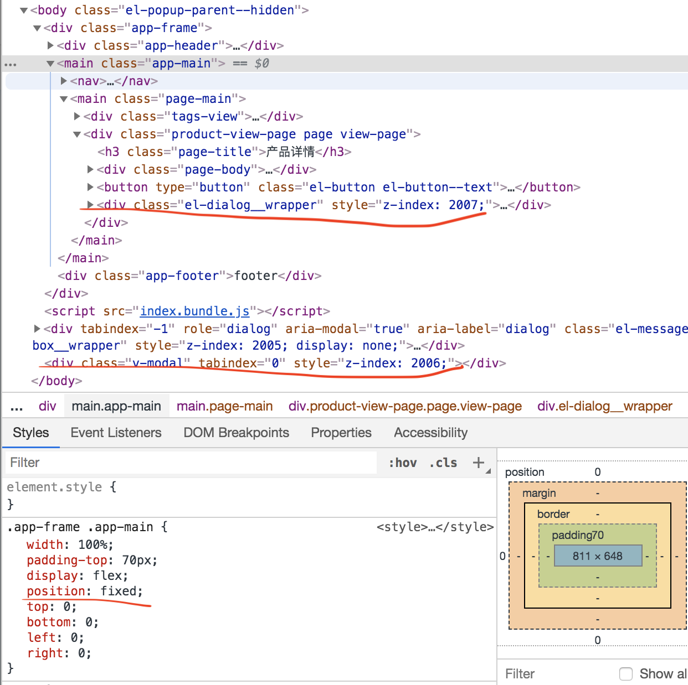

# 第18周技术周报


## 1. CSS: inline-block的元素内容发生塌陷


### a. 问题

看效果图，然后有这样的疑问为什么`some remark`部分会错位（当然可以用vertical-align的方式解决，但这里尝试解答为什么会错位的问题）：



CSS代码：

```
<style>
  .stage {
    display: inline-block;
    border: 1px solid red;
    border-radius: 5px;
  } 
  .stage.reason {
    height: 50px;
    background: #ccc;
  } 
</style>
```

HTML代码：

```
<div class="flow">
  <div class="stage">
    <div class="mark">First</div>
    <div class="desc">desc</div>
    <div class="date">2019-08-08</div>
  </div>
  <div class="stage">
    <div class="mark">Second</div>
    <div class="desc">desc</div>
    <div class="date">2019-08-08</div>
  </div>
  <div class="stage reason">
      some remark
    </div>
</div>
```

### b. 分析


[why-is-this-inline-block-element-pushed-downward](https://stackoverflow.com/questions/9273016/why-is-this-inline-block-element-pushed-downward) 是另外一个例子，但又非常通俗地介绍了 baseline、以及inline-block元素如何确定它的baseline，基本可以回答上述问题：

（1）baseline是文字对齐的基准，在div中的多个inline-block也会有一条通用的baseline，部分字母如'fgjpq`的的部分内容是下沉到baseline以下的。

（2）如果block的元素包含inline-block的元素，inline-block的overflow属性值为visible（默认就是），那么inline-block的baseline会成为block元素的baseline

（3）在例子中第三个div的baseline跟前两个是一样的，因此文字底部是对齐的，设置了高度后朝下撑开后形成了错位（至于为什么不是向上撑开是其他问题了）。可以尝试在第三个div中输入两行文字，可以看到文字第二行跟前面div的底部是对齐的。

（4）另外，之所以提到 overflow: visible，是因为其他情况下inline-block的底部如果有margin，margin会被加在baseline之上，跟相邻的inline-block还是会出现视觉上的错位。

## 2. CSS：如何实现超出边界的水平滚动条

### a. 需求


假定系统中有一个流程审批需要并排展示多个流程，项过多的时候可以进行水平滚动。

### b. 解决

HTML代码

```
<h3>产品审批进程</h3>
<div class="audit-flow">
	<div class="audit-scroll-bar">
	  <div class="audit-stage" >
	    <div class="status"></div>
	    <div class="desc bold">{{stage.text}}</div>
	    <div class="date">{{stage.time | format}}</div>
	  </div>
	</div>
</div>
```

CSS代码（部分关键代码）

```
.audit-flow {
  overflow-x: auto;
  .audit-scroll-bar {
    width: 10000px;
    .audit-stage {
      float: left;
    }
  }
}
```


解决方案是属于自己无意发现的。首先，直接使用float，发现元素过多浮动到父容器末尾的位置时会自动换行；要实现滚动条，考虑将audit-scroll-bar的宽度设置得非常大，然后在audit-flow中滚动。意外的，发现滚动条到达 audit-status的最远位置就停止了，并没有真的可以滚动10000px。

因此做一些推测：

（1）audit-stage是float的，导致audit-scroll-bar的height为0
（2）audiot-flow不受到float的影响，有了比较符合预期的宽（所有audit-stage的累计宽度）高（audit-stage的高度）。

要完全理解它，仍旧需要阅读CSS标准，尝试理解：
（1）float如何父元素，和祖先元素
（2）滚动区域是如何确定的，上例中给 audit-scroll-bar 设置 overflow: hidden/auto, 或者 border: 1px solid green; 都能打破这种滚动区域，从符合需求的宽度变到10000px。


## 3. CSS: 层叠上下文和fixed的从父原则

### a. 问题

在项目中使用 element 提供的dialog组件，弹窗发现弹出的结果如下

;

### b. 分析

;

通过查看代码，可以知道阴影层是被放在 v-modal中，body结束前；modal的额内容规则嵌套组件内的 el-dialog__wrapper中。前者的z-index为2006，后者的z-index为2007，理论上是应该弹框内容正常显示才对，不应该是被阴影层遮盖。

[文章：层叠顺序与堆栈上下文知多少](http://www.cnblogs.com/coco1s/p/5899089.html)介绍了层叠上下文的概念，并且最后提到了上述问题的原因：

> 其子元素的 z-index 值只在父级层叠上下文中有意义。意思就是父元素的 z-index 低于父元素另一个同级元素，子元素 z-index再高也没用。

知道了原因后发现 app-main中的fixed设置不是必须的，去除以后就可以解决该问题。


## ElementUI中能否实现el-input只输入整数，或者自己可以封装？

## Git的代码在jekins，HEAD被初始到了一个很早的节点

## 错误埋点的常用方法和手段有什么

## Element-UI提供预览的解决方案

## Vue组件是按需加载的吗？如果不是如何实现？

## sideEffects到底做了什么为什么使用后导致CSS无法被打包的问题

## pacakge-lock.json conflict and cannot add to ignore

## TODO: Webpack 拆分CSS/JS

## TODO: 学习Jekins的使用

## TODO: Axios的研究 & 整理项目代码

## TODO: Flutter的入门学习

## TODO： 研究hosts的原理

## TODO：微信小程序的学习


扩展阅读：

- block和inline涉及的模型概念
- vertical-align
- baseline是如何确定的，为什么有高度是朝下扩展的
- float如何父元素，和祖先元素
- 滚动区域是如何确定的，上例中给 audit-scroll-bar 设置 overflow: hidden/auto, 或者 border: 1px solid green; 都能打破这种滚动区域，从符合需求的宽度变到10000px。
- 层叠上下文的详细阅读


