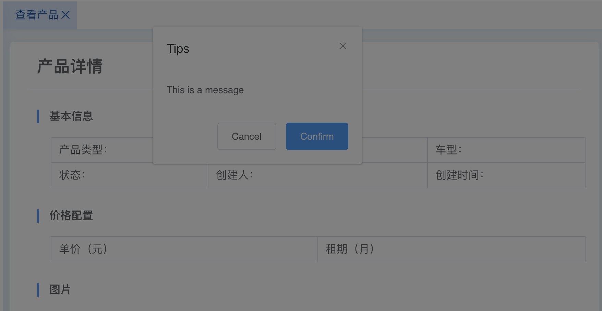

# 第18周技术周报


尝试每周总结遇到的技术问题，分享一些有用的知识点，毕竟要忙于工作事务，记录的通常只是很少一部分，但相信持续积累总会有不同的结果：

- CSS: inline-block的元素发生塌陷
- CSS：如何实现超出边界的水平滚动条
- CSS: 层叠上下文和fixed的从父原则
- Webpack项目的性能优化
- pacakge-lock.json冲突、无法被添加到.gitignore
- 修改hosts文件解决跨域调用
- Axios


## 1. CSS: inline-block的元素发生塌陷


### a. 问题

看效果图，然后有这样的疑问为什么`some remark`部分会错位（当然可以用vertical-align的方式解决，但这里尝试解答为什么会错位的问题）：


CSS代码：

```
<style>
  .stage {
    display: inline-block;
    border: 1px solid red;
    border-radius: 5px;
  } 
  .stage.reason {
    height: 50px;
    background: #ccc;
  } 
</style>
```

HTML代码：

```
<div class="flow">
  <div class="stage">
    <div class="mark">First</div>
    <div class="desc">desc</div>
    <div class="date">2019-08-08</div>
  </div>
  <div class="stage">
    <div class="mark">Second</div>
    <div class="desc">desc</div>
    <div class="date">2019-08-08</div>
  </div>
  <div class="stage reason">
      some remark
    </div>
</div>
```

### b. 分析


[why-is-this-inline-block-element-pushed-downward](https://stackoverflow.com/questions/9273016/why-is-this-inline-block-element-pushed-downward) 是另外一个例子，但又非常通俗地介绍了 baseline、以及inline-block元素如何确定它的baseline，基本可以回答上述问题：

（1）baseline是文字对齐的基准，在div中的多个inline-block也会有一条通用的baseline，部分字母如'fgjpq`的的部分内容是下沉到baseline以下的。

（2）如果block的元素包含inline-block的元素，inline-block的overflow属性值为visible（默认就是），那么inline-block的baseline会成为block元素的baseline

（3）在例子中第三个div的baseline跟前两个是一样的，因此文字底部是对齐的，设置了高度后朝下撑开后形成了错位（至于为什么不是向上撑开是其他问题了）。可以尝试在第三个div中输入两行文字，可以看到文字第二行跟前面div的底部是对齐的。

（4）另外，之所以提到 overflow: visible，是因为其他情况下inline-block的底部如果有margin，margin会被加在baseline之上，跟相邻的inline-block还是会出现视觉上的错位。

## 2. CSS：如何实现超出边界的水平滚动条

### a. 需求


假定系统中有一个流程审批需要并排展示多个流程，项过多的时候可以进行水平滚动。

### b. 解决

HTML代码

```
<h3>产品审批进程</h3>
<div class="audit-flow">
	<div class="audit-scroll-bar">
	  <div class="audit-stage" >
	    <div class="status"></div>
	    <div class="desc bold">{{stage.text}}</div>
	    <div class="date">{{stage.time | format}}</div>
	  </div>
	</div>
</div>
```

CSS代码（部分关键代码）

```
.audit-flow {
  overflow-x: auto;
  .audit-scroll-bar {
    width: 10000px;
    .audit-stage {
      float: left;
    }
  }
}
```


解决方案是属于自己无意发现的。首先，直接使用float，发现元素过多浮动到父容器末尾的位置时会自动换行；要实现滚动条，考虑将audit-scroll-bar的宽度设置得非常大，然后在audit-flow中滚动。意外的，发现滚动条到达 audit-status的最远位置就停止了，并没有真的可以滚动10000px。

因此做一些推测：

（1）audit-stage是float的，导致audit-scroll-bar的height为0
（2）audiot-flow不受到float的影响，有了比较符合预期的宽（所有audit-stage的累计宽度）高（audit-stage的高度）。

要完全理解它，仍旧需要阅读CSS标准，尝试理解：
（1）float如何父元素，和祖先元素
（2）滚动区域是如何确定的，上例中给 audit-scroll-bar 设置 overflow: hidden/auto, 或者 border: 1px solid green; 都能打破这种滚动区域，从符合需求的宽度变到10000px。


## 3. CSS: 层叠上下文和fixed的从父原则

### a. 问题

在项目中使用 element 提供的dialog组件，弹窗发现弹出的结果如下

;

### b. 分析

;

通过查看代码，可以知道阴影层是被放在 v-modal中，body结束前；modal的额内容规则嵌套组件内的 el-dialog__wrapper中。前者的z-index为2006，后者的z-index为2007，理论上是应该弹框内容正常显示才对，不应该是被阴影层遮盖。

[文章：层叠顺序与堆栈上下文知多少](http://www.cnblogs.com/coco1s/p/5899089.html)介绍了层叠上下文的概念，并且最后提到了上述问题的原因：

> 其子元素的 z-index 值只在父级层叠上下文中有意义。意思就是父元素的 z-index 低于父元素另一个同级元素，子元素 z-index再高也没用。

知道了原因后发现 app-main中的fixed设置不是必须的，去除以后就可以解决该问题。

## 4. Webpack项目的性能优化

Webpack的Code Splitting介绍了三种减少加载包大小的技术，可以尝试运用两种：

- Entry Points: 通过配置文件中的entry手动指定
- Prevent Duplication: 通过 SplitChunksPlugin 拆分 和 杜绝重复
- Dynamic Imports: 通过行内调用来拆分代码

### 4.1 SplitChunksPlugin


项目中已经采用第一种技术，根据页面的不同打成不同的bundle；现在可以通过SplitChunksPlugin将常用的commons打包。


webpack.config.js


``` 
{
  optimization: {
    splitChunks: {
      chunks: 'all'
    }
  },
  output {  	
    chunkFilename: '[name].bundle.js'
  }
}  
```

可以看到的原本生成的 index.bundle.js，现在变成了 vendors~index.bundle.js + index.bundle.js。

另外需要注意的是，如果我们有两个entry，除了生成各自的bundle以外（vendors~index.bundle.js 和 vendors~login.bundle.js)，基于这两个bundle的通用部分又被抽象成了 vendors~index~login.bundle.js，需要注意依次引入，不要遗漏。如下是示例：

dist/index.html

```
    <script src="./vendors~index~login.bundle.js"></script>
    <script src="./vendors~index.bundle.js"></script>
    <script src="./index.bundle.js"></script>
```


webpack.config.js

```
plugins: [
    new HtmlWebpackPlugin({
      inject: false,
      filename: 'login.html',
      template: './dist/login.html',
      chunks: ["vendors~index~login", "vendors~login", "login"]
    }),
    new HtmlWebpackPlugin({
      inject: false,
      filename: 'index.html',
      template: './dist/index.html',
      chunks: ["vendors~index~login", "vendors~index", "index"]
    }),
```

    <script src="./vendors~index~login.bundle.js"></script>
    <script src="./vendors~index.bundle.js"></script>
    <script src="./index.bundle.js"></script>

### 4.2 Routes Dynamic Imports

首先在项目的根目录新建文件 .babelrc：

```
{
  "plugins": ["@babel/plugin-syntax-dynamic-import"]
}
```

将路由都从

```
import AppFrame from "cp/app-frame.vue";
```

改成如下的写法

```
const AppFrame = () => import('cp/app-frame.vue');
```

这时候可以看到每次加载一个新组件的时候，都会请求单独的js。


### 4.3 按需加载element UI

参考 [element quick start](https://element.eleme.cn/#/en-US/component/quickstart) 进行配置，可以将对应的bundle文件减小，其中development环境bundle文件大小从7.5M减小到5M，production大小从 1.2M 减小到 815KB。

## 5. pacakge-lock.json冲突、无法被添加到.gitignore


[resolving-lockfile-conflicts](https://docs.npmjs.com/files/package-locks.html#resolving-lockfile-conflicts)

> As of npm@5.7.0, these conflicts can be resolved by manually fixing any package.json conflicts, and then running npm install [--package-lock-only] again. npm will automatically resolve any conflicts for you and write a merged package lock that includes all the dependencies from both branches in a reasonable tree. 


[cant-make-git-stop-tracking-package-lock-json](https://stackoverflow.com/questions/44600721/cant-make-git-stop-tracking-package-lock-json)

> gitignore only works for untracked files. If you have a tracked file that is also in your .gitignore, the fact that the file is tracked overrides the fact that it is also in .gitignore.


[do-i-commit-the-package-lock-json-file-created-by-npm-5](https://stackoverflow.com/questions/44206782/do-i-commit-the-package-lock-json-file-created-by-npm-5)

> Yes, package-lock.json is intended to be checked into source control. If you're using npm 5, you may see this on the command line: created a lockfile as package-lock.json. You should commit this file.

## 6. 修改hosts文件解决跨域调用

Mac环境下使用Chrome浏览器，想在本地调用钉钉的登陆接口，会出现 redirect_uri 不允许的问题。因为在钉钉内部注册的应用，只能配置一个允许redirect的地址，假定地址是 local-erp.tbsite.net，可以通过修改本地 /etc/hosts 配置文件解决该问题：


```
127.0.0.1       local-erp.tbsite.net
```

## 7. Axios


### 7.1 为什么要用Axios


[Jquery ajax, Axios, Fetch区别之我见](https://segmentfault.com/a/1190000012836882)对三种技术的特点分析，可以看到Axios是最适合当前编程使用的，它使用Promise语法、支持node.js、支持并发请求、支持拦截器等。
	
### 7.2 项目中基础的运用

[Github:Axios](https://github.com/axios/axios) 足够清楚到你能找到你所需要的所有信息。


