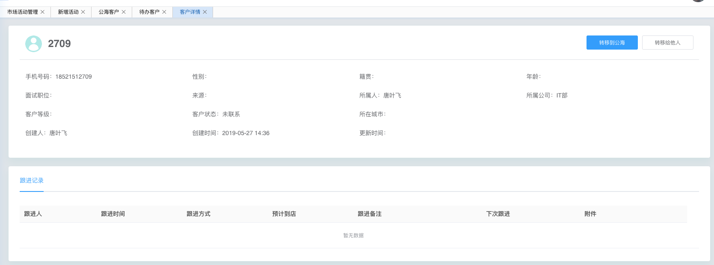

## 1. for...of VS for...in的用法

for...of是用于遍历实现了Iterator接口的元素

for...in访问的是对象属性，如果是数组（特殊的对象）则是访问的数组下标

## 2. postman vs chrome直接访问的区别

**问题**

想通过GET请求一个通用的json当做字典，请求域名会不同，在Chrome下报错：

`No 'Access-Control-Allow-Origin' header is present on the requested resource.`

**分析**

接口方法和头部字段都符合简单请求的要求，因此不会通过OPTIONS询问后端。

但在postman下是可以请求到的，因此怀疑是否自己的参数不对，最后通过实验可以得出结论：

想在浏览器端访问，后端必须配置 Access-Control的若干头部字段，在postman中可以请求到，而在Chrome中报错是因为：数据已经到达了浏览器，但是被浏览器给block了。

## 3. vue keep-alive的应用




项目中自己手动实现了多页签，每次切换页签的时候通过 `$router.push` 来更改 `router-view` 渲染的component。

问题在于，每次切换tab都会导致component重新渲染，查询文档知道`keep-alive`可以将打开过的component缓存起来，并制定最多可以缓存的组件个数，只需要像如下方式进行包裹即可：

```
<keep-alive>
	<router-view :key="$route.fullPath" class="view-page"></router-view>
</keep-alive>
```

原理大概是在内存中缓存了，另外再实际使用中又遇到了一些问题：

（1）组件的表单中提交成功过后，仍旧替我们缓存了填写过的数据。应对是手动清楚数据。
（2）在一些交互性的输入框中，也缓存了我们输入过的数据。能想到的在组件提供个钩子中数据重置。

实际使用中，会遇到一些问题，比如：

（1）我们希望缓存的组件个数有所限制，keep-alive提供了max属性可以用于控制
（2）我们能自主决定删掉某个组件的缓存，在自己模拟实现了多页签的时候尤其有用，发现可以拿到缓存的对象，然后进行手动删除，详见下面的 `手动清除keep-alive缓存`
参考：

- 官方文档：[https://cn.vuejs.org/v2/guide/components-dynamic-async.html](https://cn.vuejs.org/v2/guide/components-dynamic-async.html)

- 使用介绍：[http://blog.myweb.kim/vue/keep-alive/?utm-source=segmentfault](http://blog.myweb.kim/vue/keep-alive/?utm-source=segmentfault)

- 原理分析：[https://juejin.im/post/5cce49036fb9a031eb58a8f9](https://juejin.im/post/5cce49036fb9a031eb58a8f9)

- 手动清除keep-alive缓存：[https://wanyaxing.com/blog/20180723114341.html](https://wanyaxing.com/blog/20180723114341.html)

## 4. vue style scoped

在项目中经常遇到引用某个第三方组件，想要覆写它的样式，如果自己的style中加了scoped，是没法生效的。实际看dom长这样 `<div data-v-7ba5bd90="" id="app">`，同样样式代码也被编译成了 `#app[data-v-7ba5bd90]{}`，这样防止了对其他的同样选择器的dom的污染。

scoped不会处理子组件中的dom，因此如果想让子组件能够样式被覆写，需要去掉scoped，在父级别加上合适的父级class防止污染到其他地方即可。

## 5. webpack merge

在实际开发中，开发环境和生产环境提供了两份配置文件，绝大多数的配置都是相同的，差异仅仅体现在 

（1）mode: 为 development 或 production

（2）在 development 环境需要配置 devServer，和为devServer注入html所使用的 plugins.HTMLWebpackPlugin

通过 webpack-merge 可以将基础的配置抽象到 webpack.base.js中，开发环境和线上环境分别使用 webpack.dev.js 和 webpack.prod.js，然后 merge(webpack.base.js)即可。


## 6. 基于EC2搭建上网配置

之前一直是购买的vultr的虚拟服务器来配置上网，经人提醒EC2的一年免费使用，于是申请了AWs的账号并且建了EC2的instance，然后在机器配置了ss，上网速度很不错。

如下是值得参考的两篇文章：

[参考注册和建EC2实例](https://or7.me/2017/08/26/AWS_SS_Hello_World/)
[参考如何跑ss](https://github.com/shadowsocks/shadowsocks/tree/master)

