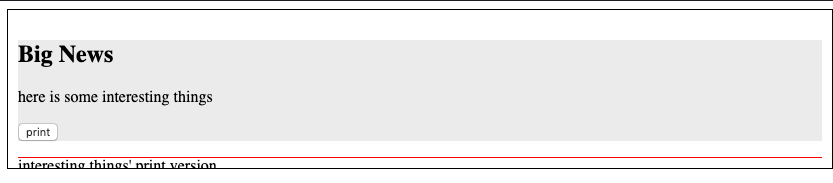
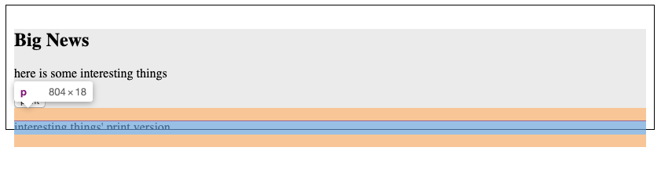
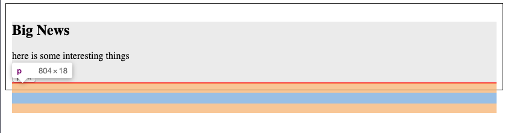

# 技术周报第1期


## 1. 由父子元素的margin collapse导致的问题

参考如下代码后[打开示例@codepen](https://codepen.io/Yefei/pen/KKKGvEG)

```<div class="page">
  
  <article>
    <h1>Big News</h1>
    <p>
      here is some interesting things
    </p>
    <button>print</button>
  </article>
  <!-- content not hope been seen but would be used when print   -->
  <div class="print">
    <p>interesting things' print version</p>
    <p>should not been seen on page!!!!!</p>
  </div>
</div>```

```
.page {
  overflow: hidden;
  border: 1px solid #000;
  padding: 10px;
}
article {
  background: #eee;
}
.print {
  height: 1px; 
  background: red;
/*   padding-top: 1px; */
}
```

### 背景：

参考示例如下预览效果，页面有按钮可以唤起打印机打印底部的内容，但不期望在页面中直接看到被打印内容。

;

### 分析：

直接在设置`.print`为如下代码可以达到隐藏打印内容的效果，但是打印不出被hidden的内容(打印是第三方JS工具的实现，具体逻辑不知）。

```
height:1px;
overflow-y:hidden
```


于是期望`.print`下的`p`元素的默认`margin`会将真正的内容区域挤压到`.page`的可视区域下面，单实际效果却是`p`的`margin`会导致整个`.page`容器被撑高，`p`中内容仍旧能在页面中看到。


;

### 解决：

在`.print`上`padding-top: 1px;`的注释放开后，发现可以达到效果：`p`的`marign`没有再向上撑开父元素`.print`。




实际上这是margin collapse的一个应用，相邻的block元素，在垂直（top bottom)方向的margin会合并，最常见的场景是：

- 在兄弟元素间
- 父子元素间（子元素没有padding）


上述例子中，父元素`.print`的`padding/border`都为0，子元素的`margin-top`继承自浏览器有默认值，因此`marign-top`合并并体现到父元素上。

### 参考：

[margin-collapse-in-css-what-why-and-how](https://medium.com/@joseph0crick/margin-collapse-in-css-what-why-and-how-328c10e37ca0#fe08)