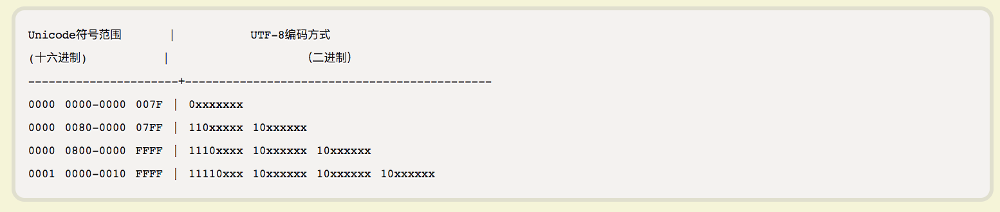

> 要使用utf-8来存储 "你好,Señorita" 需要用到多少个字节？

知识：要知道每个字符用utf-8编码占用的长度不一致，需要找到参考依据

思路：将字符串通过charCodeAt(i 0->11).toString(16)来得到16进制的表示，再参考如下表格，计算分别可以判定每个字符会使用多少个字符


代码：

```
var s = "你好,**Señorita";
for(var i = 0; i < s.length; i++) {console.log(s.charCodeAt(i).toString(16));}

// 4f60 3
// 597d 3
// 2c 1
// 53 1
// 65 1
// f1 2
// 6f 1
// 72 1
// 69 1
// 74 1
// 61 1
total 16
```