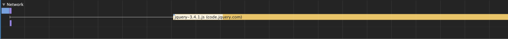
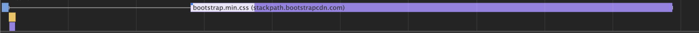

# 网站性能优化实践

网站的性能直接影响到用户的使用体验，加载过慢导致的白屏、响应不及时导致的卡顿，都会降低用户对网站的评价。为了提高网站的性能，我们需要分析网站从加载到最终呈现、以及用户操作的响应的过程中，究竟发生了什么。


## 1. 使用工具衡量性能

在开始进行优化之前，需要强调一点是：必须以真实统计的数据为依据，优化过程中必须看妨碍性能的关键指标是否发生了变化。

[PageSpeed Insights](https://developers.google.com/speed/pagespeed/insights/?hl=zh-cn) 是由 Google 提供的一个检测网站性能的工具，输入网站地址后它会返回网站性能的得分，以及具体改善性能的建议，可以看到它提供了在 移动设备 和 桌面设备的不同评分，可以针对不同设备来做具体的优化。


[Chrome DevTools](https://developers.google.com/web/tools/chrome-devtools)作为最重要的网页开发调试工具，几乎能查看到网页加载使用过程的一切信息，作为开发者有必要掌握运用开发者工具。


我们尝试以[https://leetcode.com/](https://leetcode.com/) 为例，可以看到它在 `PageSpeed Insights` 和`Chrome DevTools`上的测试结果。


上图可以看到性能的评分为40分，然后有 首次内容渲染、首次输入延迟 以及 实验室数据等多项统计数据，其中绿/橙/红分别代表了优/一般/差的表现。同时它还提供了优化建议和诊断结果，有助于用户改善网站性能。


上图可以看到很多信息，包含了FPS/CPU/Networks/Frames/Interactions/Timing，我们先选中Main这一项，可以看到统计了5.67s内的监测数据，底部面板呈现了在Loading、Script、Renddering等阶段的耗时。将底部的Tab切换到Event Log，并且将Scripting和Rendering取消勾选，可以看到各个时间点发生的事件，下图截取了一部分：


最头部的Send Request和Receive Response成功请求获取到了HTML的内容，然后在parseHTML中，解析出了对更多资源的加载，于是又触发了更多新的请求，Finish Loading事件则标志着某个资源的加载的结束。

这里只是一个开头，后续就要开始介绍影响性能的两个途径，即：优化关键渲染路径、优化代码书写方式。借助于上述的工具，我们能够很好的衡量网站在具体指标上的表现。

## 1. 优化关键渲染路径


### 1.1 关键渲染路径

[关键渲染路径](https://developer.mozilla.org/en-US/docs/Web/Performance/Critical_rendering_path) 简单来说就是浏览器将HTML、CSS和JavaScript转化为可见的像素的过程。这个过程包含如下几个步骤：


网页的第一请求个是HTML请求，请求到达服务器后，服务器处理并且返回响应，客户端收到响应后开始进行处理，最后进行展示和布局，对应的过程为：

- request
- loading
- response
- scripting：parse，DOM Tree，CSSOM Tree，Render Tree
- rendering：layout
- painting: paint

在scripting阶段，HTML parsing过程创建了DOM（document object model）Tree，在parsing的过程中，遇到任意链接的外部资源（比如样式文件、js文件、图片文件），浏览器都会发起一个新的请求。

浏览器会持续不断进行parsing的过程构建DOM，发送获取资源的请求，直到最终结束以后，它开始构建 CSSOM（CSS object model）。在DOM和CSSOM都完成了，浏览器会构建好Render Tree，计算说有可见的内容的样式。

在rendering阶段，Render Tree构建好以后，开始进行Layout操作，它决定元素放置的位置和大小。

等这一切结束以后，在painting阶段，网页通过称为被paint的步骤被绘制出来。

### 1.2 资源的阻塞问题

关于关键渲染路径过程，非常重要的一点是，一些资源的请求是阻塞性的。

TODO  将下述内容该高度概括下****

### 1.3 什么阶段做优化

### 1.4 如何优化关键渲染路径


#### 资源并行加载

文件加载通常先出现的标签先加载，但并不串行，即它们的过程可同时进行。结果就是一些比较大的文件虽然先加载，但可能后加载完成。


```
// html-CRP-block.html
<head>
  <script src="https://code.jquery.com/jquery-3.4.1.js"></script>
  <script src="link-jquery.js"></script>
  <link rel="stylesheet" href="bg-color.css"></link>
</head>
<body>
  <p>Hello, CRP!!!</p>
</body>
```

```
//link-jquery.js
console.log('jquery download and executed ? ' + (!!$ ? 'yes' : 'not ye'));
```

```
//bg-color.css
p {
	background: red;
}
```

我们用Chrome Devtools的Performance记录下来网络情况（如下图），首当其冲的是HTML，然后是 `link-jquery.js` 和 `bg-color.css`文件，虽然`jquery-3.4.1.js`先出现但是却后开始加载，也是后开始完成。


#### JS的加载和执行

##### 按照出现顺序执行


如下为console中的输出结果，可见虽然js后面的先加载完，但是执行顺序还是严格依赖出现顺序的。

```
jquery download and executed ? yes
```

##### 阻塞HTML/CSS的解析

```
// html-CRP-block.html
<head>
  <link rel="stylesheet" href="bg-color.css"></link>
</head>
<body>
  <script src="https://code.jquery.com/jquery-3.4.1.js"></script>
  <script src="link-jquery.js"></script>
  <p id="hello">Hello, CRP!!!</p>
</body>
```

```
//link-jquery.js
console.log('jquery download and executed ? ' + (!!$ ? 'yes' : 'not ye'));
```

如上代码中，我们可以在console中看到的输出结果为null，说明JS的加载执行过程，block了网页的解析，因为直接查询DOM Tree是没有该结构的。


```
<head>
  <title>Document</title>
  <link rel="stylesheet" href="bg-color.css"></link>
</head>
<body>
  <p id="hello">Hello, CRP!!!</p>
  <script src="https://code.jquery.com/jquery-3.4.1.js"></script>
  <style>p {background:green;}</style>
</body>
```


同样通过上述代码，可以看到p的背景色首先是红色，然后过了一段时间（jquery加载）后会变成绿色。同理，我们可以童工Performance查看到，jquery加载和执行完成以后，才回继续parseHTML，style被处理完，最终触发DOMContentReady事件。


#### CSS的加载和执行

可以看到`bootstrap.css`加载完后，继续执行了 Parse Stylesheet，Parse HTML（后有触发了Parse Stylesheet 和 Evaluate Script），然后才是Recalculate Style。




我可以把阻塞的类型简单分为：阻塞加载、阻塞执行、阻碍渲染。

浏览器的parsing过程的，


## 2. 优化代码书写方式

## 3. 在移动端的性能优化